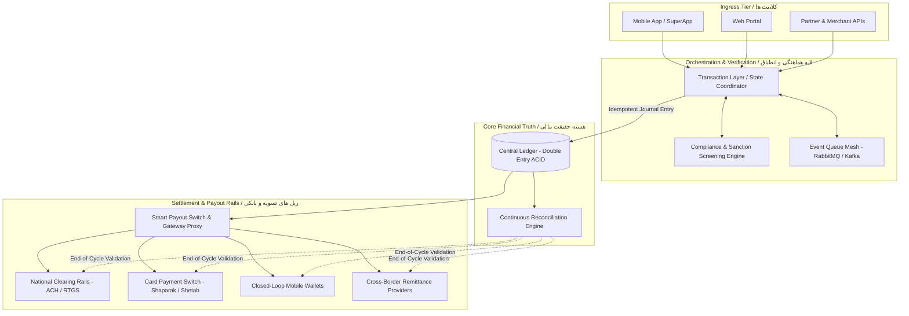
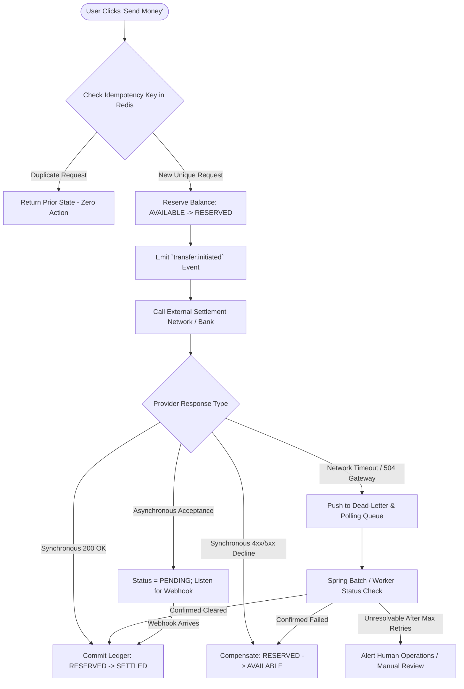
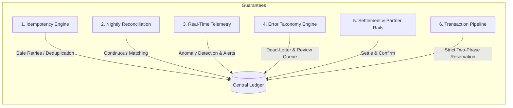
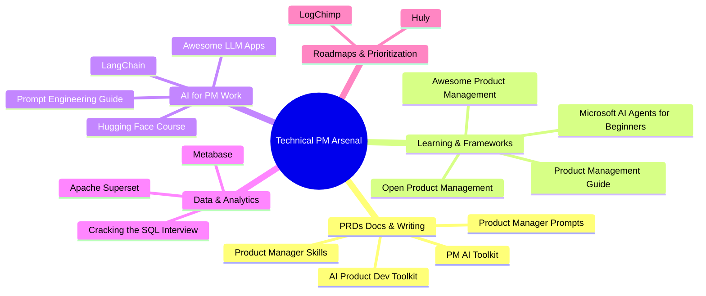

# The Modern Fintech Engineering & Product Architecture Playbook
## راهنمای جامع معماری سیستم‌های مالی، ریل‌های پرداخت و جعبه‌ابزار مدیران محصول فنی

**Author:** Ariya Sarrafzadeh  
**Domain:** [ariya-sarrafzadeh.ir](https://ariya-sarrafzadeh.ir)  
**Target Audience:** Fintech Product Managers, Distributed Systems Architects, Lead Engineers, and Platform Builders  
**Topics:** Distributed Financial Ledgers, Remittance Pipelines, Idempotency, Card Security (CVV/PCI-DSS), Asynchronous Provider Workflows, Technical PM GitHub Arsenal  
**Languages:** English & Persian (فارسی و انگلیسی)  

---

## 📑 Table of Contents / فهرست مطالب
1. [Executive Overview / نمای کلی](#1-executive-overview--نمای-کلی)
2. [Pillar I: The Physics of Money Movement & Why Fintech Systems Fail](#2-pillar-i-the-physics-of-money-movement--why-fintech-systems-fail)
   - [The Illusion of "API 200 OK" / توهم موفقیت تراکنش با کد ۲۰۰](#the-illusion-of-api-200-ok--توهم-موفقیت-تراکنش-با-کد-۲۰۰)
   - [The Core Anatomy of High-Scale Remittance Systems](#the-core-anatomy-of-high-scale-remittance-systems)
   - [Architectural Topology: Money Flow Engine](#architectural-topology-money-flow-engine)
   - [Correctness Under Failure: The Central Ledger Invariant](#correctness-under-failure-the-central-ledger-invariant)
   - [Handling Provider Heterogeneity: Webhook vs. Polling vs. Sync](#handling-provider-heterogeneity-webhook-vs-polling-vs-sync)
3. [Pillar II: Card Security, Sensitive Authentication Data (SAD) & PCI-DSS Compliance](#3-pillar-ii-card-security-sensitive-authentication-data-sad--pci-dss-compliance)
   - [Deconstructing Card Security: CVV2 vs CVC2 vs CID](#deconstructing-card-security-cvv2-vs-cvc2-vs-cid)
   - [Why the "2" Matters: CVV1 vs CVV2 vs EMV vs Dynamic OTP](#why-the-2-matters-cvv1-vs-cvv2-vs-emv-vs-dynamic-otp)
   - [The Strict PCI-DSS Rule: Zero-Storage of SAD](#the-strict-pci-dss-rule-zero-storage-of-sad)
   - [End-to-End Card Authorization & Token Vault Topology](#end-to-end-card-authorization--token-vault-topology)
4. [Pillar III: The Technical & AI Product Manager's Open-Source Arsenal](#4-pillar-iii-the-technical--ai-product-managers-open-source-arsenal)
   - [The New Paradigm: Technical PMs Closer to Code](#the-new-paradigm-technical-pms-closer-to-code)
   - [Curated 17 Repositories Categorized Breakdown](#curated-17-repositories-categorized-breakdown)
   - [PM Matrix: Applying Open-Source Tools to Fintech Lifecycles](#pm-matrix-applying-open-source-tools-to-fintech-lifecycles)
5. [Summary Checklist for Fintech Builders / چک‌لیست نهایی معماران فین‌تک](#5-summary-checklist-for-fintech-builders--چک‌‌لیست-نهایی-معماران-فین‌تک)

---

## 1. Executive Overview / نمای کلی

### English
Moving money in software is fundamentally distinct from manipulating records in a standard SaaS database. In routine applications, a failed API request triggers an error message, and state rollback is straightforward. In fintech, banking, and remittance ecosystems, an API failure occurring *after* capital has already transitioned across external rails can result in irreversible financial loss, duplicate payouts, and ledger corruption.

This comprehensive guide brings together three critical pillars required to design, scale, and lead enterprise financial platforms:
1. **Distributed System Mechanics**: Building fault-tolerant, idempotent money movement pipelines centered on double-entry ledgers.
2. **Payment Card Security & Regulatory Compliance**: Engineering token vaults and handling Sensitive Authentication Data (CVV/CVC/CID) under strict PCI-DSS constraints.
3. **Product Leadership & AI Tooling**: Equipping platform PMs with the curated open-source engines, prompt architectures, and data frameworks required to manage mission-critical roadmaps.

### فارسی
انتقال پول در نرم‌افزار، تفاوت ساختاری بنیادینی با پردازش داده‌ها در برنامه‌های متداول SaaS دارد. در یک سیستم معمولی، بروز خطا در یک فراخوانی API صرفاً منجر به نمایش پیام خطا می‌شود؛ اما در سیستم‌های فین‌تک و انتقال وجه بین‌بانکی، بروز خطای شبکه یا تایم‌اوت *پس از خروج پول از حساب کاربر* می‌تواند فاجعه‌بار باشد و به پرداخت‌های تکراری، مغایرت‌های غیرقابل جبران و آسیب شدید مالی منجر گردد.

این مرجع جامع، سه ستون حیاتی برای طراحی، مدیریت محصول و مهندسی سیستم‌های مقیاس‌بالای مالی را پوشش می‌دهد:
۱. **فیزیک جابجایی پول و مهندسی سیستم‌های توزیع‌شده**: پیاده‌سازی زیرساخت‌های مقاوم در برابر خطا و دفترکل متمرکز تغییرناپذیر.
۲. **امنیت کارت‌های پرداخت و استاندارد بین‌المللی PCI-DSS**: معماری زون‌های امن نگهداری داده‌های کارت و تحلیل کدهای امنیتی CVV2/CVC2 و توکنایزیشن.
۳. **جعبه‌ابزار مدرن مدیران محصول هوش مصنوعی و سیستم‌های فنی**: معرفی ۱۷ مخزن و فریم‌ورک متن‌باز برتر گیت‌هاب جهت ارتقای بهره‌وری تیم‌های فنی و محصولی.

---

## 2. Pillar I: The Physics of Money Movement & Why Fintech Systems Fail

### The Illusion of "API 200 OK" / توهم موفقیت تراکنش با کد ۲۰۰

#### English
Most fintech and remittance systems do not crash instantly; they deteriorate gradually, then collapse catastrophically under load.
- At low transaction volumes, systems appear healthy: transfers succeed, balances sync, and external payment partners respond predictably.
- As the platform scales to millions of users, multiple upstream banks, mobile wallets, and payout aggregators, cracks widen:
  1. **Stuck Transfers**: Transactions remain in an ambiguous state due to network timeouts between internal microservices and external bank switches.
  2. **Ghost Payouts**: An external payment provider completes the disbursement, but internal timeouts leave the local transaction marked as `PENDING`.
  3. **Duplicate Payouts via Naive Retries**: When an unacknowledged transaction is blindly retried by scheduled jobs, the user receives multiple payouts for a single order.
  4. **Ledger Drift**: Internal balances no longer balance with external clearing house statements.

The root cause: **Treating a financial transaction as a standard synchronous CRUD entity.** In payments, receiving an HTTP `200 OK` from an API gateway only means that the request was *received*, not that the funds have settled into the destination account.

```
❌ Common Anti-Pattern:
Client Request ──► [App Server] ──► Deduct Balance in DB ──► Call Bank API (HTTP 200) ──► Commit DB
                                                                      │
                                                   (Timeout / Split-Brain)
                                                                      ▼
                                                         Disaster: State Desync!
```

#### فارسی
اکثر پلتفرم‌های پرداخت و حواله مالی ناگهان سقوط نمی‌کنند؛ آن‌ها ابتدا به آرامی دچار فرسایش شده و با افزایش حجم تراکنش، دچار شکست سیستمی می‌شوند:
- در مقیاس پایین، همه چیز ایده‌آل است: بالانس‌ها آپدیت شده، تراکنش‌ها انجام می‌شوند و سرویس‌‌دهنده‌های بانکی پاسخ مناسب می‌دهند.
- اما با جهش مقیاس و افزایش تعداد بانک‌ها، کیف‌های پول و شرکای تسویه:
  ۱. **تراکنش‌های معلق**: به دلیل تایم‌اوت‌های شبکه میان سیستم داخلی و سوئیچ بانکی، وضعیت تراکنش نامعلوم می‌ماند.
  ۲. **پرداخت‌های شبح‌وار**: پول در بانک مقصد با موفقیت واریز شده، اما سیستم داخلی به دلیل تایم‌‌اوت وضعیت را `PENDING` می‌شناسد.
  ۳. **خطر پرداخت مکرر بر اثر Retry غیر اصولی**: سیستم تلاش مجدد انجام می‌دهد و برای یک سفارش، چندین بار به حساب مشتری پول واریز می‌کند.
  ۴. **شکست در مغایرت‌گیری**: دفاتر کل مالی داخلی دیگر با اسناد تسویه شبانه بانک‌ها همخوانی ندارند.

ریشه مشکل اینجاست: **نگاه کردن به تراکنش مالی مانند یک عملیات ساده CRUD.** بازگشت کد `HTTP 200` از سمت درگاه یا سرویس‌دهنده، صرفاً به معنای دریافت پیام است، نه تسویه و انتقال قطعی وجه به حساب مقصد.

---

### The Core Anatomy of High-Scale Remittance Systems

To move money safely, a financial architecture must decouple **State Management**, **External Provider Communication**, and **Ledger Execution** into dedicated, autonomous subsystems:



#### Responsibilities of Each Layer
1. **Transaction Layer**: Coordinates user intent, manages transactional tickets, enforces idempotency keys, and transitions the state machine (e.g., `INITIATED` $\rightarrow$ `RESERVED` $\rightarrow$ `SETTLING` $\rightarrow$ `SETTLED`).
2. **Central Ledger (Source of Truth)**: The immutable double-entry journal. Every financial action must write balanced debit and credit entries. It never holds loose "balance" variables.
3. **Queue / Event Mesh**: Decouples long-running bank network calls from synchronous client HTTP lifecycles using transactional event streaming.
4. **Compliance & Sanction Screening**: Enforces real-time AML (Anti-Money Laundering), fraud detection, maximum velocity limits, and blacklist matching before any capital reservation.
5. **Reconciliation Engine**: Asynchronously cross-compares internal ledger records against external bank clearing logs (e.g., Shaparak/Paya settlement files), identifying discrepancies and triggering compensating actions.

---

### Failure Modes Under Scale: What Sits Behind the "Send Money" Button

When transaction volume surges, external payment rails expose systems to high-concurrency anomalies. A production architecture must handle each:



---

### Correctness Under Failure: The Central Ledger Invariant

To guarantee absolute financial integrity during network disruptions, the system enforces **Correctness Under Failure** through six architectural pillars:



1. **Idempotency**: Every transaction carries an immutable UUID or tracking code. Retries sent due to mobile network disconnects safely return the existing transaction state rather than duplicating funds movement.
2. **Double-Entry Invariant**: 
   $$\sum_{i=1}^{n} \text{Debit}_i - \sum_{j=1}^{m} \text{Credit}_j = 0$$
   No balance is adjusted without a matching offset account (e.g., User Available Wallet $\rightarrow$ Escrow/Pending Bucket).
3. **Continuous Reconciliation**: Automated matching jobs run on hourly and daily cycles to confirm that every internal journal record corresponds to a verified bank reference number (RRN).
4. **Classified Error Handling**: Errors are strictly divided into:
   - *Transient (Network/Timeout)*: Safe to query status or retry with backoff.
   - *Terminal (Insufficient Funds, Invalid Card/IBAN)*: Immediate rollback; no retry.
   - *Ambiguous (Funds debited upstream, no callback received)*: Isolated for auto-polling or tier-2 human intervention.

---

### Handling Provider Heterogeneity: Webhook vs. Polling vs. Sync

External financial institutions never communicate uniformly. An enterprise gateway proxy standardizes disparate provider behaviors into a single state machine:

| Provider Integration Pattern | Failure Risk | Architectural Countermeasure |
| :--- | :--- | :--- |
| **Synchronous (Immediate Response)** | High risk of HTTP client timeout if bank switch is saturated. | Set aggressive timeouts (e.g., $3000\text{ ms}$). Fall back instantly to asynchronous status inquiry. |
| **Asynchronous Webhook** | Webhooks may be delayed, dropped, or delivered out of order. | Treat webhooks as idempotent triggers. Verify signature, check current ledger state, and process only if in a non-final state. |
| **Polling / Status Inquiry** | Excessive polling causes rate-limiting; sparse polling degrades UX. | Exponential backoff with jitter ($2\text{s}, 4\text{s}, 8\text{s}, 16\text{s}, 30\text{s}$). Store next check timestamp in Redis. |

---

## 3. Pillar II: Card Security, Sensitive Authentication Data (SAD) & PCI-DSS Compliance

### Deconstructing Card Security: CVV2 vs CVC2 vs CID

#### English
When completing a Card-Not-Present (CNP) purchase on a website or super-app, the user provides their Primary Account Number (PAN), expiration date, and a 3- or 4-digit security code. The payment industry assigns network-specific terminologies to these codes:

- **CVV2 (Card Verification Value 2)**: Associated with Visa.
- **CVC2 (Card Validation Code 2)**: Associated with Mastercard.
- **CID (Card Identification Number)**: Associated with American Express (4 digits on front) and Discover (3 digits on back).

#### فارسی
در تراکنش‌های بدون حضور فیزیکی کارت (Card-Not-Present - CNP)، کاربر علاوه بر شماره ۱۶ رقمی کارت (PAN) و تاریخ انقضا، یک کد امنیتی ۳ یا ۴ رقمی وارد می‌کند. شبکه‌های بین‌المللی پرداخت نام‌گذاری‌های اختصاصی برای این کد دارند:
- **CVV2**: متعلق به شبکه ویزا (Visa).
- **CVC2**: متعلق به شبکه مسترکارت (Mastercard).
- **CID**: متعلق به شبکه امریکن اکسپرس (۴ رقم روی کارت) و دیسکاور (۳ رقم پشت کارت).

---

### Why the "2" Matters: CVV1 vs CVV2 vs EMV vs Dynamic OTP

A common question among backend engineers is: *Why is there a "2" at the end of CVV2 / CVC2?*

```
┌────────────────────────────────────────────────────────────────────────┐
│                        CARD SECURITY CODING MATRIX                     │
├───────────────┬──────────────────────────────────┬─────────────────────┤
│ Security Type │ Storage / Generation Medium       │ Primary Use Case    │
├───────────────┼──────────────────────────────────┼─────────────────────┤
│ CVV1 / CVC1   │ Magnetic Stripe Tracks (Track 1&2│ In-Person POS Swipe │
├───────────────┼──────────────────────────────────┼─────────────────────┤
│ CVV2 / CVC2   │ Physically printed on plastic card│ E-Commerce / CNP    │
├───────────────┼──────────────────────────────────┼─────────────────────┤
│ ARQC (EMV)    │ Generated dynamically by EMV chip│ Chip & PIN / NFC    │
├───────────────┼──────────────────────────────────┼─────────────────────┤
│ Harim OTP     │ Generated dynamically via SMS/App│ Iranian CNP Payments│
└───────────────┴──────────────────────────────────┴─────────────────────┘
```

1. **CVV1 / CVC1**: Encoded directly onto the magnetic stripe. When a card is physically swiped at a POS terminal, the terminal reads CVV1. It proves the physical card is present at the terminal, but cannot be read visually.
2. **CVV2 / CVC2**: Printed on the signature panel. It proves the customer possesses the physical card (or its visual surface) during online checkout. Because CVV1 and CVV2 have different mathematical derivations, a data breach of printed CVV2 codes cannot be used to clone magnetic stripes.
3. **What CVV2 is NOT**:
   - It is **not** an EMV Cryptogram (such as an ARQC—Application Request Cryptogram), which is dynamically computed per-transaction by a microprocessor chip.
   - It is **not** 3-D Secure (3DS) or an SMS-based dynamic OTP (like the Iranian Central Bank's **Harim** system), which adds out-of-band identity authentication.

---

### The Strict PCI-DSS Rule: Zero-Storage of SAD

The **Payment Card Industry Data Security Standard (PCI-DSS)** draws an absolute line between Cardholder Data (CHD) and **Sensitive Authentication Data (SAD)**:

$$\text{Cardholder Data (CHD)} = \{\text{PAN}, \text{Cardholder Name}, \text{Expiration Date}\}$$
$$\text{Sensitive Authentication Data (SAD)} = \{\text{Full Track Data}, \text{CVV2 / CVC2 / CID}, \text{PIN / PIN Block}\}$$

#### The Golden Mandate
> **PCI-DSS Requirement 3.2:** Do NOT store sensitive authentication data after authorization (even if encrypted!). 

If an application database, log file, cache (Redis), or error monitoring system (Sentry) stores CVV2 codes—even encrypted using AES-256—the platform is in direct, severe violation of global and local financial compliance rules. 

While a merchant may store a **Card-on-File Token** or masked PAN (`6037-99**-****-1234`) for one-click checkouts and subscriptions, the CVV must always be re-collected or bypassed via secure delegated token rails.

---

### End-to-End Card Authorization & Token Vault Topology

To comply with PCI-DSS and national banking directives, card credentials must never touch standard application microservices:

```mermaid
sequenceDiagram
    autonumber
    actor Customer as Cardholder
    participant Browser as Secure Client (Web/SuperApp)
    participant CoreApp as Core Application Gateway
    participant Vault as Isolated PCI Token Vault
    participant PSP as Payment Switch / Bank Proxy
    participant Issuer as Card Issuer Bank (HSM)

    Customer->>Browser: Enters PAN, Expiry, CVV2
    Browser->>Vault: Direct Transmit (Client-Side Encrypted via Vault Public Key)
    Vault->>Vault: Store PAN in Secure Isolated Storage; Issue Ephemeral Card Token
    Vault-->>Browser: Return Ephemeral Token (e.g., `tkn_984f...`)
    
    Browser->>CoreApp: Submit Order (with Ephemeral Token + Order Metadata)
    Note over CoreApp: Core App NEVER touches or logs raw PAN or CVV2!
    
    CoreApp->>PSP: Dispatch Payment Request (using Ephemeral Token)
    PSP->>Vault: Request Authorized Payload for Bank Route
    Vault->>PSP: Forward Ephemeral Encrypted Authorization Packet
    
    PSP->>Issuer: Transmit ISO 8583 / REST Authorization Request
    Issuer->>Issuer: Verify CVV using Bank HSM Cryptographic Master Key
    Issuer->>Issuer: Evaluate Risk Matrix (Available Credit, Velocity, 3DS/Harim OTP)
    
    alt Verification Approved
        Issuer-->>PSP: Authorization Approved (Auth Code: 49210)
        PSP-->>CoreApp: Transaction Successful
        CoreApp-->>Customer: Order Complete Screen
    else Verification Declined
        Issuer-->>PSP: Decline Code (Invalid Security Code / Expired)
        PSP-->>CoreApp: Transaction Declined
        CoreApp-->>Customer: Decline Notification (Prompt Re-Entry)
    end

    Note over Vault,PSP: CVV2 is Purged from In-Memory Buffers; NEVER Persisted to Disk!
```

---

## 4. Pillar III: The Technical & AI Product Manager's Open-Source Arsenal

### The New Paradigm: Technical PMs Closer to Code

As platform architectures, AI agents, and distributed fintech systems grow increasingly complex, the traditional divide between "business PMs" and "engineering" has collapsed. A top 1% Product Manager does not need to write production backend microservices, but must understand:
- Event schemas and message broker topologies (RabbitMQ/Kafka).
- How to draft complete, machine-readable Product Requirement Documents (PRDs).
- How to interact with self-hosted BI databases using raw SQL.
- How to prototype functional applications using AI prompt chains and modern dev toolkits.

Below is an exhaustive, curated guide to the **17 most impactful open-source repositories** mapped to the day-to-day workflow of technical fintech and platform product managers.

---

### Curated 17 Repositories Categorized Breakdown



---

### 1. PRDs, Documentation & Writing / مستندسازی و نگارش فنی

#### 1. PM AI Toolkit
- **Repository Scope:** A specialized collection of production-grade AI prompts, OKR templates, RICE prioritization frameworks, and Model Context Protocol (MCP) integrations for Jira, Notion, and Slack.
- **Why Product Managers Need It:** Eliminates manual document structuring. Allows PMs to feed high-level user interview notes and instantly receive structured functional specs, edge-case matrices, and release notes.

#### 2. Product Manager Prompts
- **Repository Scope:** Optimized system prompts for generating standardized User Stories, Jobs-to-be-Done (JTBD) profiles, market positioning briefs, and executive stakeholder communications.
- **Why Product Managers Need It:** Standardizes team communication. Ensures technical user stories follow the strict format:  
  *As a [persona], I want to [action], so that [business value], with clear [Acceptance Criteria].*

#### 3. Product Manager Skills
- **Repository Scope:** Structured technical workflows and skill trees specifically built for Claude Code and modern AI coding assistants. Focuses on transforming PRDs directly into technical roadmaps and architectural prioritization tickets.
- **Why Product Managers Need It:** Enables PMs to speak the exact programmatic vocabulary of their engineering teams, verifying API contracts and database schema requirements before sprint planning.

#### 4. AI Product Dev Toolkit
- **Repository Scope:** End-to-end sequential workflow templates linking:  
  $$\text{PRD} \longrightarrow \text{UX Specification} \longrightarrow \text{MVP Scope} \longrightarrow \text{v0 / Cursor Prompt Chains}$$
- **Why Product Managers Need It:** Bridges the gap between product ideation and interactive clickable prototypes. Enables a PM to deploy working web UI prototypes in hours to validate UX before engineering commits sprint capacity.

---

### 2. Learning & Strategic Frameworks / یادگیری و فریم‌ورک‌های محصول

#### 5. Awesome Product Management
- **Repository Scope:** The definitive, community-curated reading list of elite PM books, tactical essays, teardowns, analytics guides, and career roadmaps.
- **Why Product Managers Need It:** Acts as an encyclopedic reference manual for evaluating business models, retention metrics (LTV, CAC, Churn), and product-market fit metrics across B2B and consumer fintech.

#### 6. Open Product Management
- **Repository Scope:** A curated knowledge base designed specifically for engineers transitioning into product roles and technical PMs managing complex infrastructures.
- **Why Product Managers Need It:** Deep-dives into backlog refinement, dependency management across distributed microservices, and technical stakeholder negotiation.

#### 7. Product Management Guide
- **Repository Scope:** Step-by-step navigational guide covering day-to-day PM responsibilities: discovery interviews, usability testing, release coordination, and post-launch retrospectives.
- **Why Product Managers Need It:** A structured blueprint for junior to mid-level PMs to standardize team operational cadence and minimize chaos across sprints.

#### 8. Microsoft AI Agents for Beginners
- **Repository Scope:** An 11-lesson comprehensive curriculum created by Microsoft explaining multi-agent architectures, reasoning loops, memory systems, and tools.
- **Why Product Managers Need It:** Product managers cannot design modern AI workflows without understanding agentic limits. This course provides the conceptual foundation to design agentic customer support, automated KYC verification, and smart underwriting bots.

---

### 3. AI for PM Work & Prototype Building / کاربری هوش مصنوعی در محصول

#### 9. Awesome LLM Apps
- **Repository Scope:** Over 100 ready-to-run application templates utilizing LLMs with RAG (Retrieval-Augmented Generation), vector databases, and multi-modal models.
- **Why Product Managers Need It:** Allows platform PMs to clone and test working proof-of-concepts (e.g., automated document analyzers for merchant onboarding) without waiting on internal engineering bandwidth.

#### 10. Prompt Engineering Guide
- **Repository Scope:** The gold-standard industry guide covering Chain-of-Thought (CoT), ReAct, Directional Stimulus, and Few-Shot prompting.
- **Why Product Managers Need It:** Essential for PMs designing generative AI features or fine-tuning automated system prompts in production AI microservices.

#### 11. LangChain
- **Repository Scope:** The industry-standard open-source orchestration framework for building context-aware, reasoning LLM applications.
- **Why Product Managers Need It:** Reading the LangChain documentation and codebase gives PMs the precise vocabulary needed to review AI technical architectures and debug latency bottlenecks with ML engineers.

#### 12. Hugging Face Course
- **Repository Scope:** Comprehensive open-source educational program covering transformers, dataset curation, model fine-tuning, and model deployment.
- **Why Product Managers Need It:** Demystifies NLP and computer vision (crucial for eKYC liveness detection and facial recognition), allowing PMs to evaluate model precision, recall, and false positive rates realistically.

---

### 4. Data Analytics & Business Intelligence / داده و هوش تجاری

#### 13. Cracking the SQL Interview
- **Repository Scope:** Comprehensive compendium of advanced SQL queries, window functions, CTEs (Common Table Expressions), query optimization techniques, and schema design principles.
- **Why Product Managers Need It:** Data independence is the superpower of elite PMs. Relying on data analysts for routine funnel conversion or cohort retention queries slows product iteration. Every PM must be fluent in multi-table joins and aggregation queries.

#### 14. Metabase
- **Repository Scope:** The most popular open-source, self-hostable business intelligence and visualization platform.
- **Why Product Managers Need It:** Enables PMs to build custom dashboards, track daily active wallets, monitor payment success rates (PSR), and analyze conversion drops without writing custom frontend code.

#### 15. Apache Superset
- **Repository Scope:** Enterprise-grade, highly scalable cloud-native data exploration and visualization platform (utilized at Airbnb, Lyft, and Twitter).
- **Why Product Managers Need It:** Handles massive petabyte-scale analytical queries against ClickHouse, Trino, and Snowflake, making it ideal for high-throughput fintech transaction telemetry.

---

### 5. Roadmaps & Prioritization Engines / نقشه راه و مدیریت تسک‌ها

#### 16. Huly
- **Repository Scope:** A modern, blazing-fast, open-source project management platform that unifies issues, roadmaps, customer support tickets, and team chat (a lightweight, modern alternative to Jira and Linear).
- **Why Product Managers Need It:** Provides a clean, developer-friendly interface to manage cross-functional product roadmaps while preserving bidirectional traceability between business goals and Git commits.

#### 17. LogChimp
- **Repository Scope:** An open-source, self-hostable customer feedback aggregation and roadmap tracker with integrated public changelog capabilities.
- **Why Product Managers Need It:** Centralizes inbound merchant feedback, enables voting on feature requests, and automatically maintains an audit-proof changelog of API updates.

---

### PM Matrix: Applying Open-Source Tools to Fintech Lifecycles

| Fintech Product Lifecycle Stage | Recommended Repository | Practical PM Use Case |
| :--- | :--- | :--- |
| **Discovery & Legal Feasibility** | `Prompt Engineering Guide` + `PM Prompts` | Draft structured compliance inquiry briefs to Central Bank / Shaparak legal regulators. |
| **Technical PRD & Schema Spec** | `PM AI Toolkit` + `PM Skills` | Define idempotent API schemas, event queue payload contracts, and error code catalogs. |
| **Rapid Prototype & Dogfooding** | `AI Product Dev Toolkit` + `Awesome LLM Apps` | Prototype interactive merchant onboarding verification portals using v0 and local LLM chains. |
| **Telemetry & KPI Tracking** | `Cracking the SQL Interview` + `Metabase` | Construct real-time dashboards for Payment Success Rate (PSR) and Shaparak settlement cycle tracking. |
| **Customer Feedback & Roadmapping** | `Huly` + `LogChimp` | Manage merchant feature requests (e.g., multi-IBAN payouts) and publish transparent API changelogs. |

---

## 5. Summary Checklist for Fintech Builders / چک‌لیست نهایی معماران فین‌تک

Before approving any architectural design or product release in a financial environment, verify the following six non-negotiable checks:

- [ ] **Zero Sensitive Authentication Data Storage**: Ensure that under no circumstances are raw CVV2/CVC2 codes, PIN blocks, or raw magstripe tracks written to disk, databases, or application log files.
- [ ] **Strict Ledger Double-Entry Balance**: Verify that every monetary action writes balanced debit and credit entries such that net total delta strictly equals zero ($\sum \Delta = 0$).
- [ ] **End-to-End Idempotency**: Confirm that every transfer, payment, and refund endpoint requires a unique client-generated tracking key to eliminate duplicate execution risks.
- [ ] **Asynchronous Rails Isolation**: Decouple upstream bank network calls from synchronous user HTTP request-response threads using reliable message broker queues (RabbitMQ/Kafka).
- [ ] **Multi-Cycle Automated Reconciliation**: Implement scheduled batch jobs (e.g., Spring Batch) to cross-verify internal ledger records against external bank clearing house files.
- [ ] **Clear Failure & Rollback Semantics**: Ensure that when timeouts occur on third-party bank switches, the system automatically transitions into an isolated pending queue rather than blind retries or premature transaction abandonment.

---
*Published as an open technical resource for the Iranian and Global Fintech & Product Management Community at [ariya-sarrafzadeh.ir](https://ariya-sarrafzadeh.ir).*