# High-Scale Iranian Fintech Microservices Architecture: The Production Blueprint

**Author:** Ariya Sarrafzadeh  
**Website:** [ariya-sarrafzadeh.ir](https://ariya-sarrafzadeh.ir)  
**Target Audience:** Distributed Systems Architects, Lead Backend Engineers, and Technical Product Managers  
**Core Technologies:** Java (Spring Boot, Spring WebFlux), RabbitMQ, Redis, MongoDB, MySQL, MinIO, PCI Demilitarized Zones  
**Domain Scope:** Iranian Payment Rails, Shaparak, Double-Entry Ledger, Smart PSP Switching, BNPL & Revolving Limits, Sovereign eKYC, Automated Merchant Early Settlement  

---

## Table of Contents
1. [Architectural Overview & Ecosystem Realities](#1-architectural-overview--ecosystem-realities)
2. [Global System Topology](#2-global-system-topology)
3. [Edge Gateway & Transactional Ticket AuthNZ](#3-edge-gateway--transactional-ticket-authnz)
4. [Double-Entry Wallet Ledger Engine](#4-double-entry-wallet-ledger-engine)
5. [Smart PSP Payment Switch & Network Isolation](#5-smart-psp-payment-switch--network-isolation)
6. [Purchase Aggregator & Multi-Party Dynamic Split](#6-purchase-aggregator--multi-party-dynamic-split)
7. [BNPL & Consumer Credit Origination Pipeline](#7-bnpl--consumer-credit-origination-pipeline)
8. [Installment Lifecycle, Debt Recovery & Revolving Limits](#8-installment-lifecycle-debt-recovery--revolving-limits)
9. [National Banking Rails & Direct Debit](#9-national-banking-rails--direct-debit)
10. [24-Hour Merchant Early Settlement Engine](#10-24-hour-merchant-early-settlement-engine)
11. [Sovereign eKYC & PKI Digital Signature Provider](#11-sovereign-ekyc--pki-digital-signature-provider)
12. [Event-Driven Eventual Consistency & Auto-Healing](#12-event-driven-eventual-consistency--auto-healing)
13. [Product Manager Operations & SLA Matrix](#13-product-manager-operations--sla-matrix)

---

## 1. Architectural Overview & Ecosystem Realities

Building a high-throughput financial ecosystem in Iran requires solving a set of constraints rarely encountered in Western platforms:
1. **Heterogeneous, Fragmented Bank Protocols:** Unlike unified developer APIs (such as Stripe or Adyen), Iranian payment institutions (PSPs including SEP, PEC, BPM, PEP) maintain distinct legacy protocols, varying timeout dynamics, and divergent error semantics.
2. **Batch Clearing Realities:** Capital movement does not settle instantly. Transactions transition through the Central Bank's clearing house (Paya) across fixed cycles daily ($03:45$, $10:45$, $13:45$, $18:45$). Architecture must account for asynchronous reconciliation and stateful pending queues.
3. **Mandatory Card-Not-Present Security (Harim Dynamic OTP):** Online payments require integration with the Central Bank's Harim infrastructure, routing SMS and app-based dynamic passwords through banks without exposing plain-text credentials.
4. **Strict Isolation of Sensitive Data:** To satisfy regulatory compliance and PCI-DSS equivalents, primary account numbers (PAN), track data, and card security codes must never touch public or core application layers.

This blueprint details an enterprise-grade microservice architecture handling tens of millions of daily transactions across consumer super-apps, merchant dashboards, and national clearing rails.

---

## 2. Global System Topology

The platform decouples public ingress, domain orchestration, ledger accounting, payment switches, credit operations, and asynchronous telemetry into bounded microservice domains:

```mermaid
graph TB
    subgraph Ingress Tier
        MobileApp[Mobile SuperApp - Android / iOS]
        WebPortal[Merchant & Consumer Web Portals]
        Partners[External B2B Merchants]
    end

    subgraph Edge & Security Tier
        Gateway[API Gateway - Spring Cloud Gateway]
        UAA[UAA - Identity Provider & OAuth2/JWT]
        ConfigServer[Config-Server - Spring Cloud / Git]
        ScheduleMNG[Schedule-MNG - Distributed Quartz]
    end

    subgraph Core Payment & Transaction Domain
        PurchaseMNG[Purchase-MNG - Orchestrator]
        WalletMNG[Wallet-MNG - Wallet Service]
        Ledger[Wallet Provider / Double-Entry Ledger]
        SwitchPSP[Switch-PSP - Payment Switch Engine]
        RefundMNG[Refund-MNG - Multi-Channel Refund Engine]
    end

    subgraph Isolated PCI-DSS Banking Zone
        Vault[Vault Coordinator & Card Vault]
        PSPProxy[PSP-Proxy Cluster]
        BankProxy[Bank-Proxy - ACH / RTGS / Direct Debit]
    end

    subgraph Credit & BNPL Domain
        CreditOnboard[Credit-Onboarding - Loan Origination]
        CreditScore[Credit-Score - ICS & Ecosystem Matrix]
        SwitchCredit[Switch-Credit - Provider Switch]
        CreditProvider[Credit-Provider - In-House BNPL]
        InstallmentMNG[Installment-MNG - Repayment Engine]
        RevolvingMNG[Revolving-MNG - Credit Restorer]
    end

    subgraph Supplementary Services
        MerchantCredit[Merchant-Credit - Early Cashout]
        PDY[PDY - Shaparak Payment Facilitator]
        KYC[KYC Engine - Shahkar & Sabt-Ahval]
        DSP[DSP - Digital Signature PKI]
    end

    subgraph Asynchronous Backbone
        RabbitMQ((RabbitMQ Enterprise Mesh))
        ReportMNG[Report-MNG - Spring Batch Analytics]
        Audit[Audit Service - Immutable Log]
        Notification[Notification - Multi-Provider SMS/Push]
    end

    %% Ingress Traffic
    MobileApp & WebPortal & Partners -->|HTTPS / WSS| Gateway
    Gateway -->|AuthNZ Delegation| UAA
    Gateway -->|Route Traffic| PurchaseMNG
    Gateway -->|Route Traffic| WalletMNG
    Gateway -->|Route Traffic| CreditOnboard
    Gateway -->|Route Traffic| MerchantCredit

    %% Payment Pipeline
    PurchaseMNG -->|Reserve / Verify| WalletMNG
    WalletMNG -->|ACID Balance Delta| Ledger
    PurchaseMNG -->|Route Payment| SwitchPSP
    SwitchPSP -->|Encrypted Dispatch| PSPProxy
    PSPProxy -->|Tokenize PAN| Vault

    %% BNPL Pipeline
    CreditOnboard -->|Identity Verification| KYC
    CreditOnboard -->|Dual Scoring Query| CreditScore
    CreditOnboard -->|Provision Credit Line| SwitchCredit
    SwitchCredit -->|Allocate| CreditProvider
    InstallmentMNG -->|Settled Event| RevolvingMNG
    RevolvingMNG -->|Restore Ceiling| CreditProvider

    %% Async Telemetry
    PurchaseMNG & WalletMNG & SwitchPSP & InstallmentMNG -->|Publish `activity.event`| RabbitMQ
    RabbitMQ -->|Consume| ReportMNG
    RabbitMQ -->|Consume| Notification
    RabbitMQ -->|Audit Logs| Audit
```

---

## 3. Edge Layer & Transactional Ticket AuthNZ

The Edge Layer insulates internal microservices from malformed requests, network bursts, and token replay attacks.

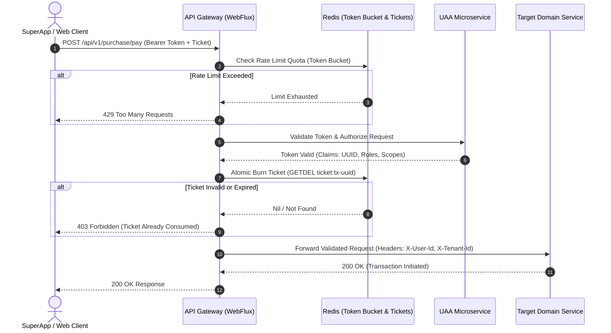

### Architectural Specifications
1. **Reactive Non-Blocking Gateway (Spring Cloud Gateway / WebFlux Netty):** Maintains high concurrent connections with minimal memory overhead, using Redis-backed token bucket algorithms for dynamic IP and Client-ID rate limiting.
2. **Stateless JWT Authority (UAA):** Signs tokens using asymmetric cryptography ($RSA\text{-}2048$). Tokens embed user profile metadata, role arrays, and tenant contexts, avoiding database read queries during routine API calls.
3. **Transactional Single-Use Tickets:** For high-value monetary mutations (e.g., executing a purchase or changing payout destinations), clients must exchange credentials for a short-lived ticket. The gateway burns this ticket atomically via Redis `GETDEL`, neutralizing replay vectors.

---

## 4. Double-Entry Wallet Ledger Engine

Financial state integrity prohibits simplistic `UPDATE users SET balance = balance - amount` operations. The system enforces an **Immutable Double-Entry Ledger (ACID)** paired with a **Two-Phase Reservation State Machine**.

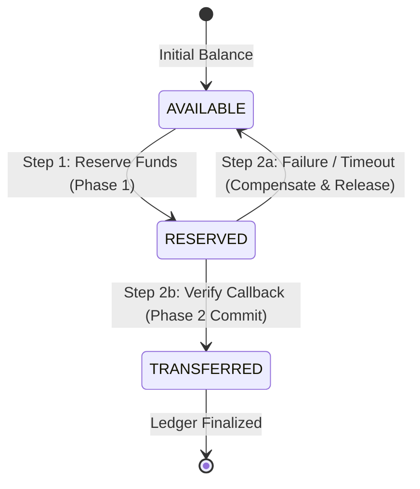

### Double-Entry Invariants
Every financial transaction writes at least two balanced journal records: a debit from the source bucket and a credit to the destination bucket. The net sum across all journal entries must always equal zero:
$$\sum_{i=1}^{n} \text{Debit}_i - \sum_{j=1}^{m} \text{Credit}_j = 0$$

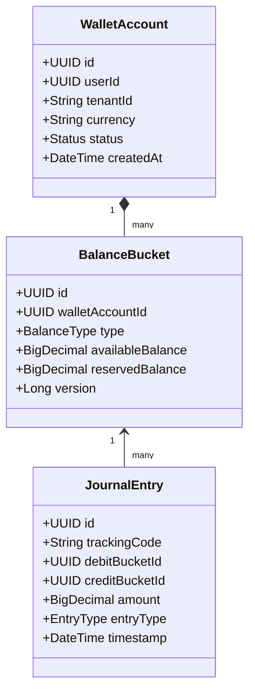

### Operational Mechanics
- **Phase 1 (Reservation):** Balance shifts from `AVAILABLE` to `RESERVED`. Funds are ring-fenced; the user cannot double-spend them, but funds have not yet departed the account.
- **Phase 2 (Commit or Compensate):** Upon receiving a cryptographically verified callback from the settlement rail, funds in `RESERVED` are deducted and credited to the merchant's settlement wallet. On network timeout or decline, funds return to `AVAILABLE`.
- **Idempotency Enforcement:** All ledger endpoints require a unique `trackingCode`. Duplicate inbound calls return the cached response, preventing duplicate debits or credits.
- **Segregated Balance Buckets:** The system isolates `CASH` balances (withdrawable via Paya/Sheba) from `INTERNAL_CREDIT` (cashback, campaign coins, non-cashoutable credits).

---

## 5. Smart PSP Payment Switch & Network Isolation

The Payment Switch decouples downstream bank idiosyncrasies while isolating sensitive cardholder credentials.

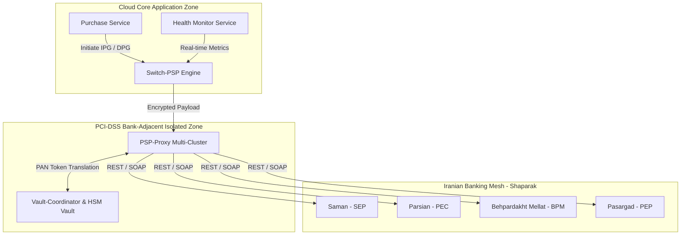

### Dynamic Switch Mechanics
1. **Dynamic Smart Routing Algorithm:** `Switch-PSP` dynamically computes a weighted routing score for each available PSP terminal every 30 seconds:
   $$\text{Score} = w_1 \cdot \text{SuccessRate}_{\text{5min}} + w_2 \cdot \frac{1}{\text{Latency}_{\text{avg}}} + w_3 \cdot \text{CostEfficiency}$$
   If an external bank gateway degrades, traffic automatically fails over to healthy PSPs within milliseconds.
2. **Payment Modalities:**
   - **Internet Payment Gateway (IPG):** Traditional two-phase redirect via Shaparak (`*.shaparak.ir`).
   - **Direct Payment Gateway (DPG - 4-Parameters):** In-app payment experience triggering the national Harim dynamic OTP rail without full-page external redirects.
3. **End-to-End Card Security:** Raw PANs are captured client-side using an ephemeral public key issued by the isolated PSP-Proxy. Core application servers never see or log raw card credentials.

---

## 6. Purchase Aggregator & Multi-Party Dynamic Split

The `Purchase-MNG` service manages checkout lifecycles, insurance splits, and multi-vendor settlements.

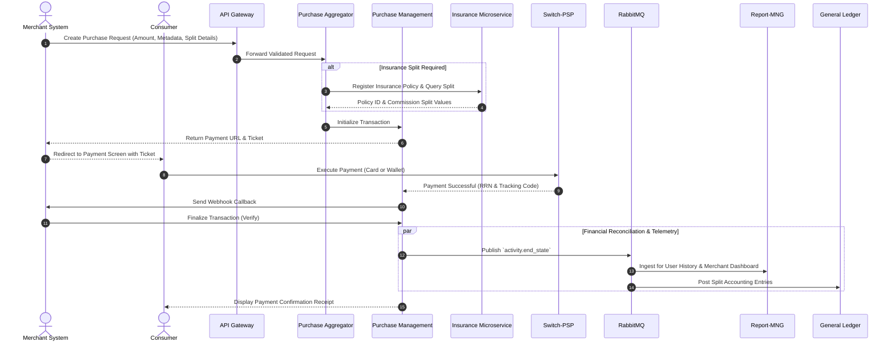

---

## 7. BNPL & Consumer Credit Origination Pipeline

Automates unsecured micro-lending, document intake, and dynamic credit allocation without manual branch visits.

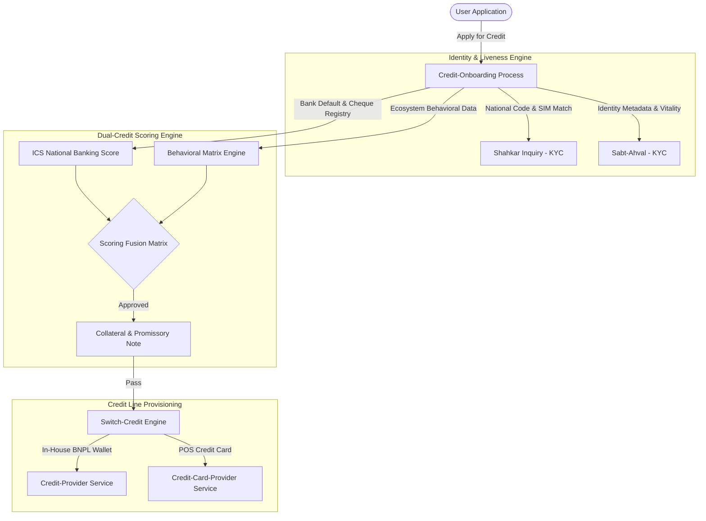

### Dual Scoring Fusion Function
$$\text{CreditLimit} = f(\text{ICS}_{\text{BankingScore}}, \text{Score}_{\text{Ecosystem}}, \text{RiskCategory}_{\text{Merchant}})$$
- **ICS (Iran Credit Scoring):** National credit bureau checking across all Iranian banks for bounced cheques, unpaid promissory notes, and loan defaults.
- **Ecosystem Behavioral Score:** Evaluates historical marketplace checkout velocity, return ratios, wallet turnover, and account age.

---

## 8. Installment Lifecycle, Debt Recovery & Revolving Limits

Manages repayment schedules, penalty calculations, underwriter risk coverage, and real-time revolving credit restoration.

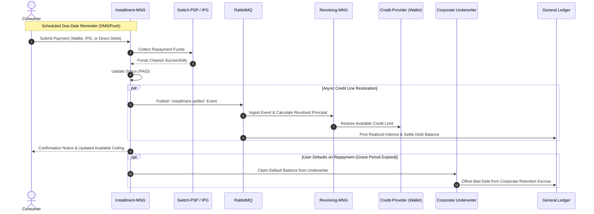

---

## 9. National Banking Rails & Direct Debit

Abstracts low-level protocol interfaces for interbank settlements, batch clearing, and card-to-card routing.

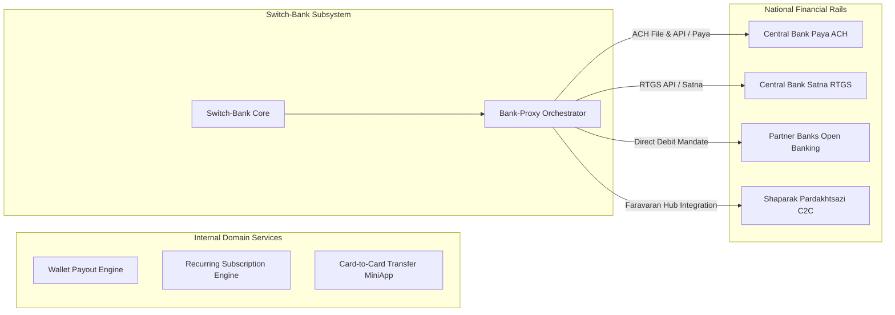

### Rail Characteristics
- **Paya (ACH):** Handles batch fund disbursements and wallet-to-bank cashouts across 4 daily clearing cycles.
- **Satna (RTGS):** Real-time gross settlement for high-value interbank transfers.
- **Direct Debit (Peyman):** Long-term digital authorization allowing automated balance deductions for subscriptions and installments with zero user friction.
- **Card-to-Card (Faravaran Hub):** Leverages authorized Payment Creation (Pardakhtsazi) licenses from Shaparak to facilitate peer-to-peer card transfers with dynamic bank switch selection.

---

## 10. 24-Hour Merchant Early Settlement Engine

Allows marketplace sellers to unlock pending liquidity within 24 hours via automated working capital loans.

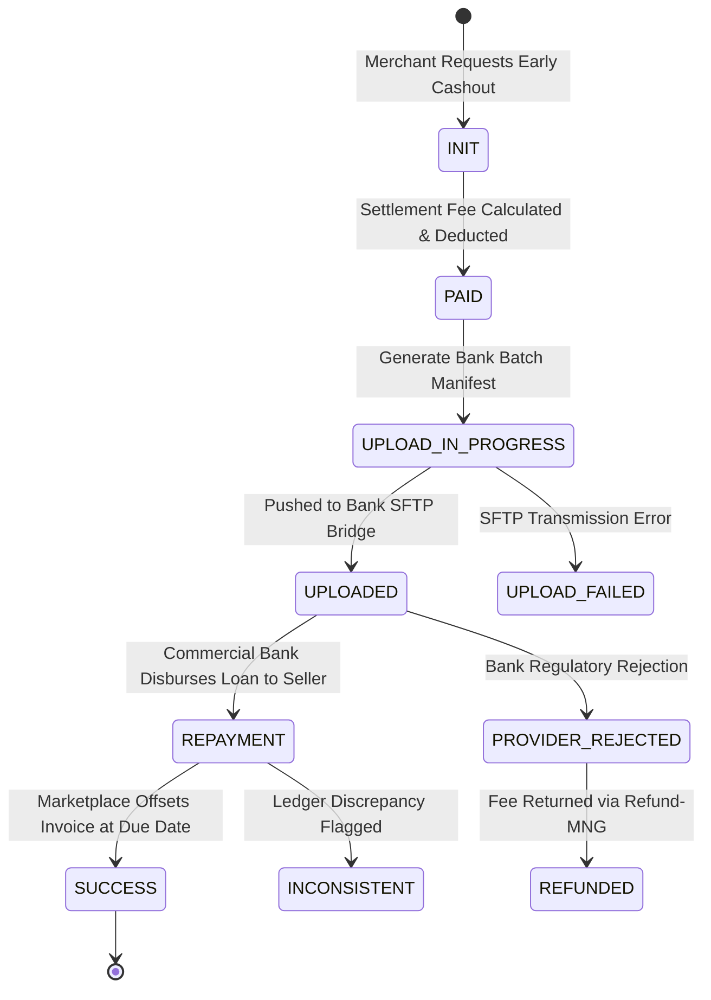

### Dynamic Daily Floating Fee
$$\text{Fee} = \text{InvoiceAmount} \cdot (r_{\text{base}} + d \cdot r_{\text{daily}})$$
Where $d$ represents the days remaining until normal accounting invoice clearing (e.g., $0.4\%$ fee for 5 days; $\sim 2.5\%$ for 30 days).

---

## 11. Sovereign eKYC & PKI Digital Signature Provider

Enables legally binding, paperless credit contracts via sovereign registry inquiries and PKI infrastructure.

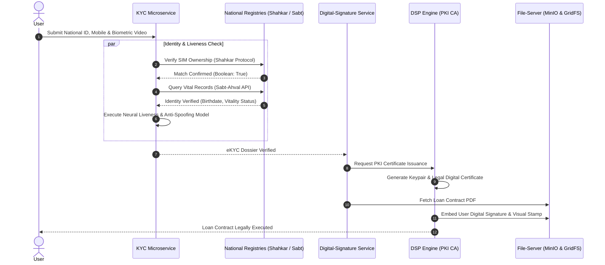

---

## 12. Event-Driven Eventual Consistency & Auto-Healing

Maintains financial consistency across microservice boundaries during bank switch outages.

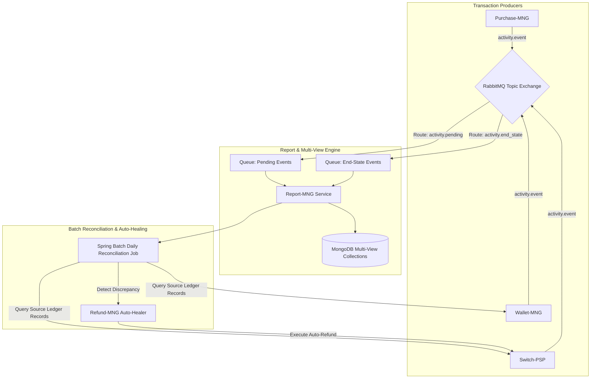

---

## 13. Product Manager Operations & SLA Matrix

Key performance indicators and automated circuit breakers for platform product managers:

| Domain | Key Performance Indicator (KPI) | Target SLA | Automated System Reaction on Breach |
| :--- | :--- | :--- | :--- |
| **API Gateway** | P99 Latency & 429 Throttle Rate | $< 50\text{ ms}$, $< 0.1\%$ | Scale Redis token buckets; shed low-priority traffic. |
| **Payment Switch** | Payment Success Rate (PSR) | $> 88\%$ per PSP | Route traffic weight to $0\%$; instant failover to backup PSP. |
| **Wallet Ledger** | Journal Invariant Balance Delta | Strictly zero ($\Delta = 0$) | Halt wallet withdrawals immediately; trigger P1 on-call alert. |
| **BNPL Origination** | Default Probability at Origination | $< 1.8\%$ NPL | Increase required ICS bank score threshold; require physical cheques. |
| **Merchant Settlement** | 24-Hour Settlement Payout Rate | $> 99.2\%$ completed | Retry bank SFTP pipeline; alert operations for manual clearing. |
| **eKYC Services** | Shahkar Verification Latency | $< 1200\text{ ms}$ | Fallback to secondary KYC aggregator; display retry screen. |

---
*Published as an architectural reference for fintech engineers and systems builders at [ariya-sarrafzadeh.ir](https://ariya-sarrafzadeh.ir).*