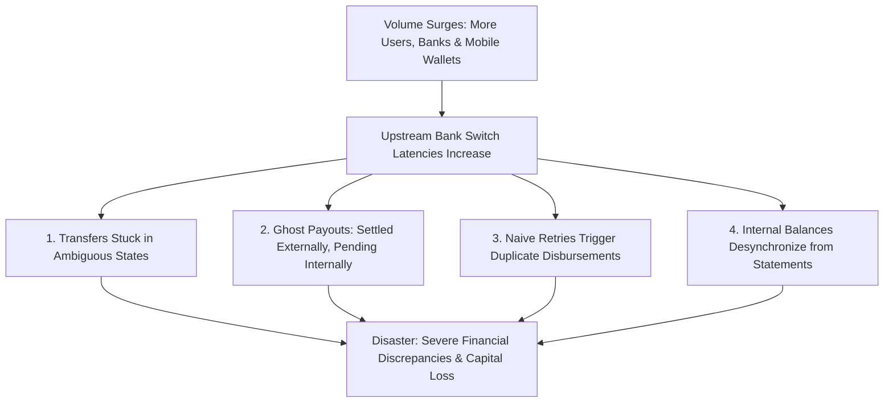
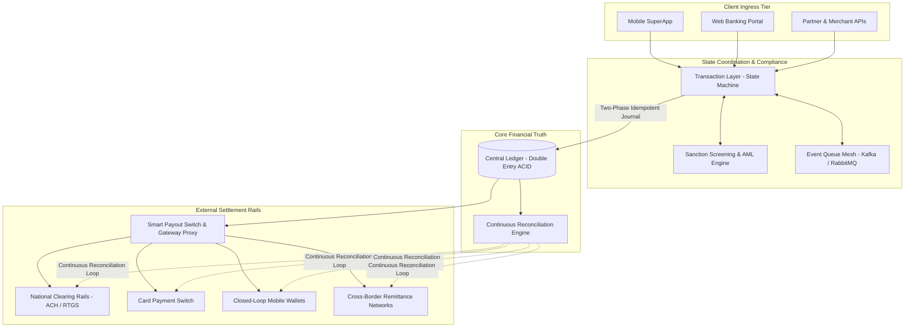
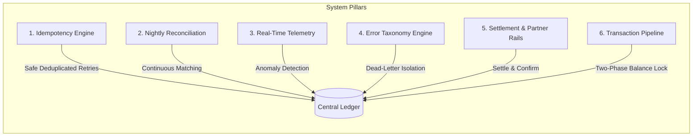

# The Physics of Money Movement: Remittance Systems, Distributed Ledgers & Payment Card Security

**Author:** Ariya Sarrafzadeh  
**Website:** [ariya-sarrafzadeh.ir](https://ariya-sarrafzadeh.ir)  
**Target Audience:** Distributed Systems Engineers, Lead Architects, and Fintech Product Managers  
**Topics:** Remittance Pipelines, Double-Entry Invariants, Distributed Idempotency, Card Security (CVV2/CVC2/CID), PCI-DSS Requirement 3.2, Ephemeral Token Vaults  

---

## Table of Contents
1. [The Physics of Remittance: Why Money Systems Fail Under Load](#1-the-physics-of-remittance-why-money-systems-fail-under-load)
2. [The Core Anatomy of High-Scale Remittance Pipelines](#2-the-core-anatomy-of-high-scale-remittance-pipelines)
3. [The Fallacy of "API 200 OK"](#3-the-fallacy-of-api-200-ok)
4. [Correctness Under Failure: The Central Ledger as Source of Truth](#4-correctness-under-failure-the-central-ledger-as-source-of-truth)
5. [Handling Provider Heterogeneity: Webhook vs. Polling vs. Synchronous](#5-handling-provider-heterogeneity-webhook-vs-polling-vs-synchronous)
6. [Payment Card Security: Demystifying CVV2 vs. CVC2 vs. CID](#6-payment-card-security-demystifying-cvv2-vs-cvc2-vs-cid)
7. [Why the "2" Matters: CVV1 vs. CVV2 vs. EMV vs. Dynamic OTP](#7-why-the-2-matters-cvv1-vs-cvv2-vs-emv-vs-dynamic-otp)
8. [The Strict PCI-DSS Rule: Zero Storage of Sensitive Authentication Data](#8-the-strict-pci-dss-rule-zero-storage-of-sensitive-authentication-data)
9. [End-to-End Authorization & Token Vault Topology](#9-end-to-end-authorization--token-vault-topology)
10. [Engineering Execution Checklist](#10-engineering-execution-checklist)

---

## 1. The Physics of Remittance: Why Money Systems Fail Under Load

Most fintech, banking, and remittance applications do not break suddenly. They deteriorate gradually under low load, masking latent synchronization bugs, and then collapse all at once when scale surges.



### The Root Cause: CRUD Thinking in Financial State Machines
The root failure in naive financial engineering is treating a transfer as a simple CRUD database update:
```
❌ The Dangerous Anti-Pattern:
Client Request ──► Deduct Balance in DB ──► Call External Bank API ──► Commit Transaction
                                                      │
                                           (Network Timeout Occurs)
                                                      ▼
                                       Financial State Unknown!
```
In money systems:
- An API failure is an operational routine.
- An API failure occurring *after* capital has crossed an external clearing boundary is catastrophic if the system is not designed around **Correctness Under Failure**.
- **Being wrong quickly is substantially worse than being right a few seconds later.** Speed is a desirable feature, but absolute correctness under network partition is the primary invariant.

---

## 2. The Core Anatomy of High-Scale Remittance Pipelines

A production money movement system must decouple **Client Ingress**, **State Coordination**, **Ledger Mutation**, and **Rail Execution** into isolated architectural planes:



### Subsystem Boundaries
1. **Transaction Layer:** Manages workflow state transitions (e.g., `INITIATED` $\rightarrow$ `RESERVED` $\rightarrow$ `SETTLING` $\rightarrow$ `SETTLED`). It never modifies account balances directly.
2. **Central Ledger (Source of Truth):** Enforces balanced double-entry accounting. It records balanced credits and debits immutably.
3. **Queue / Event Mesh:** Insulates synchronous client threads from high-latency external bank connections.
4. **Compliance & Sanction Screening:** Evaluates anti-money laundering (AML), regulatory blacklists, and velocity checks before any balance reservation.
5. **Reconciliation Engine:** Asynchronously verifies internal ledger states against external clearing house settlement files.

---

## 3. The Fallacy of "API 200 OK"

In conventional web development, an HTTP `200 OK` indicates that an operation succeeded. In payment and remittance engineering:

> **An HTTP `200 OK` from an external payment partner only confirms that the partner accepted your transmission. It does NOT mean the recipient has received the funds.**

Similarly:
- A **Network Timeout (HTTP 504 / Connection Drop)** does *not* mean the transaction failed. The upstream partner may have processed the disbursement successfully before the connection severed.
- Tightly coupling provider communication with local financial state transitions is where balance corruption begins.

---

## 4. Correctness Under Failure: The Central Ledger as Source of Truth

To guarantee financial integrity across network drops and provider crashes, the architecture centers on six self-healing pillars:



### 1. Distributed Idempotency
Every financial mutation must carry a client-generated unique tracking key (`Idempotency-Key` or `trackingCode`). When network drops cause the client to retry, the server recognizes the existing key in Redis/MySQL and returns the cached progress without re-executing credit/debit logic.

### 2. The Double-Entry Invariant
$$\sum_{i=1}^{n} \text{Debit}_i - \sum_{j=1}^{m} \text{Credit}_j = 0$$
No balance variable exists in isolation. Capital moves strictly between accounts (e.g., from `User_Available_Funds` to `Escrow_Pending_Disbursement`).

### 3. Classified Error Taxonomy
- **Transient Errors (Network drops, timeouts, upstream HTTP 503):** Pushed to backoff polling queues.
- **Terminal Errors (Insufficient funds, invalid account/IBAN, blacklisted beneficiary):** Trigger immediate compensation and ledger rollback.
- **Ambiguous States (Timeout after request dispatch):** Held in `SETTLING` state until explicit verification or manual reconciliation.

---

## 5. Handling Provider Heterogeneity: Webhook vs. Polling vs. Synchronous

Disparate financial institutions communicate via incompatible integration models. A gateway proxy abstracts these into a consistent internal state machine:

| Integration Topology | System Risks | Production Mitigation |
| :--- | :--- | :--- |
| **Synchronous Integration** | Gateway threads block waiting for bank switches, risking thread starvation under load. | Set strict timeouts ($2500\text{--}3500\text{ ms}$). Fall back immediately to an asynchronous status enquiry queue. |
| **Asynchronous Webhook** | Webhooks can be dropped, delayed by hours, or delivered out of sequence. | Enforce cryptographic signature verification. Process idempotently: update state only if transaction is currently non-final. |
| **Active Status Polling** | Over-polling exhausts rate limits; slow polling harms end-user experience. | Implement exponential backoff with randomized jitter ($2\text{s}, 4\text{s}, 8\text{s}, 16\text{s}, 32\text{s}$). Store next-check timestamps in Redis. |

---

## 6. Payment Card Security: Demystifying CVV2 vs. CVC2 vs. CID

In Card-Not-Present (CNP) e-commerce transactions, the user provides their Primary Account Number (PAN), expiration date, and a security code. Payment card networks define specific nomenclature for these codes:

- **CVV2 (Card Verification Value 2):** Visa
- **CVC2 (Card Validation Code 2):** Mastercard
- **CID (Card Identification Number):** American Express (4 digits on front of card) and Discover (3 digits on back of card)

```
┌────────────────────────────────────────────────────────────────────────┐
│                        CARD SECURITY NOMENCLATURE                      │
├───────────────────┬────────────────────────────────┬───────────────────┤
│ Network           │ Official Security Code Label   │ Standard Format   │
├───────────────────┼────────────────────────────────┼───────────────────┤
│ Visa              │ CVV2                           │ 3 digits (Back)   │
│ Mastercard        │ CVC2                           │ 3 digits (Back)   │
│ American Express  │ CID                            │ 4 digits (Front)  │
│ Discover          │ CID                            │ 3 digits (Back)   │
└───────────────────┴────────────────────────────────┴───────────────────┘
```

---

## 7. Why the "2" Matters: CVV1 vs. CVV2 vs. EMV vs. Dynamic OTP

Engineers frequently ask: *Why is there a number "2" in CVV2 and CVC2?*

```
┌────────────────────────────────────────────────────────────────────────┐
│                        SECURITY CODE COMPARISON                        │
├───────────────┬──────────────────────────────────┬─────────────────────┤
│ Security Type │ Storage / Generation Medium       │ Primary Use Case    │
├───────────────┼──────────────────────────────────┼─────────────────────┤
│ CVV1 / CVC1   │ Magnetic Stripe (Tracks 1 & 2)   │ In-Person POS Swipe │
├───────────────┼──────────────────────────────────┼─────────────────────┤
│ CVV2 / CVC2   │ Printed visibly on plastic card   │ E-Commerce / CNP    │
├───────────────┼──────────────────────────────────┼─────────────────────┤
│ ARQC (EMV)    │ Generated dynamically by EMV chip│ Chip & PIN / NFC    │
├───────────────┼──────────────────────────────────┼─────────────────────┤
│ Dynamic OTP   │ Out-of-band SMS or Banking App   │ 3DS / Two-Factor CNP│
└───────────────┴──────────────────────────────────┴─────────────────────┘
```

1. **CVV1 / CVC1:** Encoded directly into the magnetic stripe tracks. Read automatically by POS terminal hardware during a swipe. Proves the physical stripe was present, but cannot be read visually.
2. **CVV2 / CVC2:** Visually printed on the card signature panel. Proves the online shopper possesses the physical surface of the card. Because CVV1 and CVV2 are generated using different cryptographic keys, an e-commerce database breach exposing printed CVV2 codes cannot be used to clone functional magnetic stripe cards.
3. **What CVV2 is NOT:**
   - It is **not** an EMV Cryptogram (such as an ARQC—Application Request Cryptogram), which is computed dynamically per-transaction by a microprocessor chip.
   - It is **not** 3-D Secure (3DS) or an SMS-based dynamic OTP, which injects external identity verification into the payment flow.

---

## 8. The Strict PCI-DSS Rule: Zero Storage of Sensitive Authentication Data

The **Payment Card Industry Data Security Standard (PCI-DSS)** draws a sharp boundary between Cardholder Data (CHD) and **Sensitive Authentication Data (SAD)**:

$$\text{Cardholder Data (CHD)} = \{\text{PAN}, \text{Cardholder Name}, \text{Expiration Date}\}$$
$$\text{Sensitive Authentication Data (SAD)} = \{\text{Full Track Data}, \text{CVV2 / CVC2 / CID}, \text{PIN / PIN Block}\}$$

### The Cardinal Rule (PCI-DSS Requirement 3.2)
> **Do NOT store sensitive authentication data after authorization—even if encrypted!**

```
❌ Severe Compliance Violations:
• Storing CVV2 in an application database (even encrypted with AES-256).
• Writing CVV2 to application log files or APM traces (Datadog, Sentry).
• Storing CVV2 in Redis caching layers for retry logic.
```

While merchants may retain an ephemeral **Card-on-File Token** or masked PAN (`4111-11**-****-1111`) for recurring checkouts, the security code must always be discarded immediately following authorization.

---

## 9. End-to-End Authorization & Token Vault Topology

To achieve regulatory compliance, raw payment card credentials must bypass core application microservices entirely:

```mermaid
sequenceDiagram
    autonumber
    actor Customer as Cardholder
    participant Client as Secure Browser / SuperApp
    participant CoreApp as Core Application Gateway
    participant Vault as Isolated PCI Token Vault
    participant Switch as PSP Payment Switch
    participant Issuer as Card Issuer Bank (HSM)

    Customer->>Client: Enters PAN, Expiration, CVV2
    Client->>Vault: Transmit Credentials (Client-Side Encrypted via Vault Public Key)
    Vault->>Vault: Store PAN in Vault; Generate Ephemeral Token (`tkn_8471...`)
    Vault-->>Client: Return Ephemeral Token
    
    Client->>CoreApp: Submit Order (Ephemeral Token + Order Metadata)
    Note over CoreApp: Core App NEVER touches or logs raw PAN or CVV2!
    
    CoreApp->>Switch: Dispatch Payment (using Ephemeral Token)
    Switch->>Vault: Request Authorized Payment Packet
    Vault->>Switch: Dispatch Encrypted Bank Payload
    
    Switch->>Issuer: Transmit ISO 8583 / REST Authorization Request
    Issuer->>Issuer: Validate CVV2 via Bank HSM Cryptographic Master Key
    Issuer->>Issuer: Evaluate Risk Matrix (Available Balance, Velocity, 3DS)
    
    alt Verification Approved
        Issuer-->>Switch: Authorization Approved (Auth Code: 83921)
        Switch-->>CoreApp: Transaction Successful
        CoreApp-->>Customer: Order Confirmed Screen
    else Verification Declined
        Issuer-->>Switch: Decline Code (Invalid Security Code / Expired)
        Switch-->>CoreApp: Transaction Declined
        CoreApp-->>Customer: Decline Notice (Prompt Re-Entry)
    end

    Note over Vault,Switch: In-Memory Buffers Purged; CVV2 NEVER Written to Disk!
```

---

## 10. Engineering Execution Checklist

Before shipping code in a financial transaction environment, verify these six core controls:

- [ ] **Zero SAD Persistence:** Verify that no raw CVV2/CVC2 codes, PIN blocks, or magstripe tracks are written to databases, Redis caches, or log files.
- [ ] **Double-Entry Equilibrium:** Confirm that every fund transfer writes balanced debit and credit entries such that net delta strictly equals zero ($\sum \Delta = 0$).
- [ ] **Distributed Idempotency:** Enforce a mandatory unique client-generated tracking key across all payout, transfer, and refund APIs.
- [ ] **Asynchronous Rails Isolation:** Decouple external bank network calls from synchronous client HTTP threads using persistent message queues (RabbitMQ/Kafka).
- [ ] **Automated Multi-Cycle Reconciliation:** Schedule batch jobs to cross-verify internal ledger records against external bank clearing logs.
- [ ] **Timeout Auto-Polling:** When external bank calls experience network timeouts, transition the transaction into an isolated polling queue rather than blindly retrying or failing.

---
*Published as an open technical resource for payment engineers and systems architects at [ariya-sarrafzadeh.ir](https://ariya-sarrafzadeh.ir).*