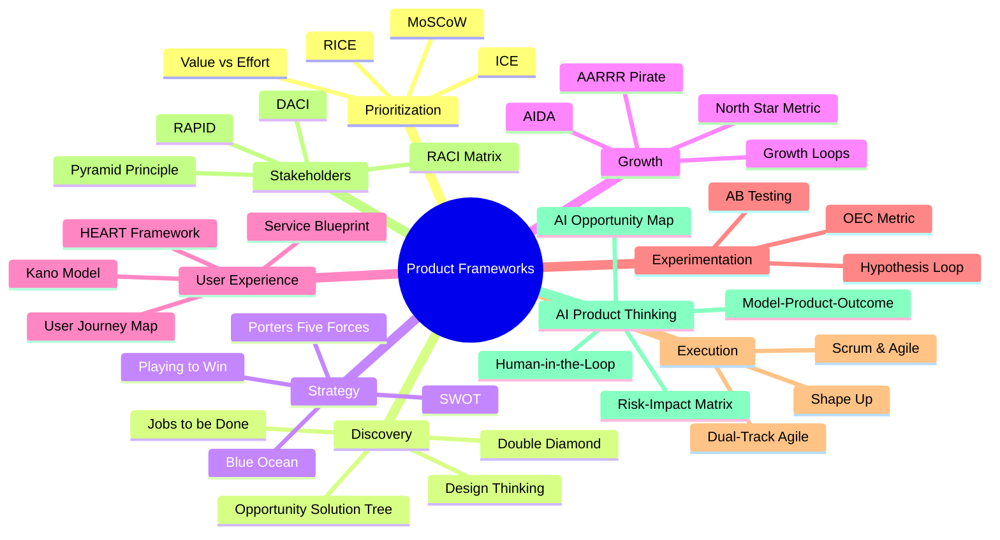
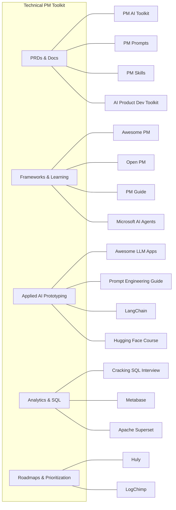
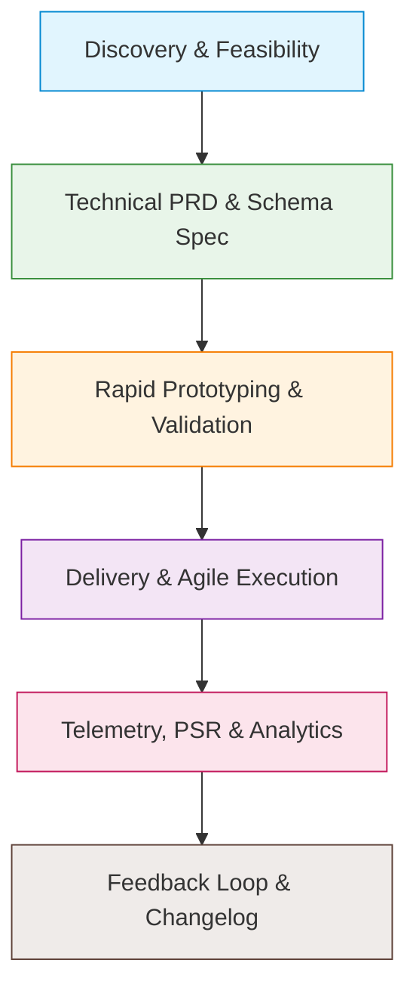

# The Technical & AI Product Manager's Playbook: Core Frameworks & Open-Source Arsenal

**Author:** Ariya Sarrafzadeh  
**Website:** [ariya-sarrafzadeh.ir](https://ariya-sarrafzadeh.ir)  
**Target Audience:** Technical Product Managers, Platform PMs, AI Product Leaders, and Engineering Leads  
**Topics:** 10 Essential PM Frameworks, Prioritization, Growth Loops, AI Thinking, 17 Open-Source GitHub Repositories, Technical PRD Engineering  

---

## Table of Contents
1. [The Philosophy: Frameworks Structure Thinking, Never Replace It](#1-the-philosophy-frameworks-structure-thinking-never-replace-it)
2. [The 10 Essential Product Management Frameworks](#2-the-10-essential-product-management-frameworks)
   - [Prioritization](#prioritization)
   - [Product Discovery](#product-discovery)
   - [Product Strategy](#product-strategy)
   - [Growth](#growth)
   - [User Experience](#user-experience)
   - [Experimentation](#experimentation)
   - [Metrics](#metrics)
   - [Execution](#execution)
   - [Stakeholder Management](#stakeholder-management)
   - [AI Product Thinking](#ai-product-thinking)
3. [The Technical PM's Open-Source Arsenal: 17 GitHub Repositories](#3-the-technical-pms-open-source-arsenal-17-github-repositories)
   - [PRDs, Docs & Technical Writing](#prds-docs--technical-writing)
   - [Strategic Learning & Frameworks](#strategic-learning--frameworks)
   - [AI for Product Work & Prototypes](#ai-for-product-work--prototypes)
   - [Data Analytics & Business Intelligence](#data-analytics--business-intelligence)
   - [Roadmaps & Issue Tracking](#roadmaps--issue-tracking)
4. [The Fintech PM Execution Matrix](#4-the-fintech-pm-execution-matrix)

---

## 1. The Philosophy: Frameworks Structure Thinking, Never Replace It

In product leadership, frameworks are cognitive tools designed to organize ambiguity, align cross-functional teams, and highlight trade-offs. They are not substitutes for product intuition, domain knowledge, or customer empathy.

As distributed systems, fintech platforms, and AI agents grow in technical complexity, the boundary between "business PMs" and "engineering" has collapsed. A high-performing Technical PM must understand database consistency, event schemas, API contracts, and AI reasoning chains while steering the strategic vision.

---

## 2. The 10 Essential Product Management Frameworks

---

### Prioritization
- **Core Frameworks:** RICE (Reach, Impact, Confidence, Effort), ICE (Impact, Confidence, Ease), MoSCoW (Must-have, Should-have, Could-have, Won't-have), Value vs. Effort Matrix.
- **When to Use:** When feature backlogs exceed engineering bandwidth and sprint capacity.
- **The PM Question:** *What creates the most enterprise value with the least engineering investment?*
- **Fintech Application:** Evaluating whether to build an in-house reconciliation engine vs. integrating a third-party KYC provider.

$$\text{RICE Score} = \frac{\text{Reach} \times \text{Impact} \times \text{Confidence}}{\text{Effort}}$$

---

### Product Discovery
- **Core Frameworks:** Jobs-to-be-Done (JTBD), Design Thinking, Double Diamond, Opportunity Solution Tree (Teresa Torres).
- **When to Use:** When navigating market ambiguity to determine which problem is truly worth solving.
- **The PM Question:** *Are we solving the right problem for our target user segment?*
- **Fintech Application:** Uncovering whether marketplace merchants drop off during onboarding because of identity verification delays or lack of transparent settlement pricing.

---

### Product Strategy
- **Core Frameworks:** SWOT Analysis, Porter's Five Forces, Playing to Win (Lafley & Martin), Blue Ocean Strategy.
- **When to Use:** Defining where the product should compete and how it will achieve sustainable defensibility.
- **The PM Question:** *Where should we play, and how will we win against incumbents?*
- **Fintech Application:** Analyzing competitive moats in BNPL micro-lending against traditional commercial banking credit lines.

---

### Growth
- **Core Frameworks:** AARRR (Acquisition, Activation, Retention, Referral, Revenue), Growth Loops, North Star Metric, AIDA (Attention, Interest, Desire, Action).
- **When to Use:** Diagnosing bottlenecks in the customer acquisition engine and optimizing compounding growth mechanics.
- **The PM Question:** *What user behavior drives sustainable, self-reinforcing product adoption?*
- **Fintech Application:** Transitioning from linear ad spend to viral growth loops where merchant payout links drive consumer wallet activations.

---

### User Experience
- **Core Frameworks:** User Journey Mapping, Service Blueprint, Google HEART (Happiness, Engagement, Adoption, Retention, Task Success), Kano Model.
- **When to Use:** Identifying points of friction across multi-step digital interactions.
- **The PM Question:** *Where are users experiencing cognitive friction, and why?*
- **Fintech Application:** Developing an end-to-end Service Blueprint for eKYC onboarding that connects consumer UI screens with background government database calls (Shahkar and Sabt-Ahval).

---

### Experimentation
- **Core Frameworks:** A/B Testing, Hypothesis $\rightarrow$ Experiment $\rightarrow$ Learn Loop, ICE Scoring for Tests, Overall Evaluation Criterion (OEC).
- **When to Use:** Gathering empirical evidence before committing engineering capacity to full-scale rollouts.
- **The PM Question:** *What is the fastest, lowest-cost experiment to validate our riskiest assumption?*
- **Fintech Application:** A/B testing a 4-parameter direct checkout form against a traditional bank redirect to measure conversion rate uplift.

---

### Metrics
- **Core Frameworks:** North Star Metric, Input vs. Output Metrics, HEART, AARRR Funnel Metrics.
- **When to Use:** Connecting daily engineering activities to measurable enterprise outcomes.
- **The PM Question:** *Are we measuring vanity activity or actual business impact?*
- **Fintech Application:** Setting Payment Success Rate (PSR) and Net Transaction Volume as core input metrics that drive the North Star Metric (Total Monthly Settled Volume).

---

### Execution
- **Core Frameworks:** Agile, Scrum, Dual-Track Agile (Discovery vs. Delivery), Shape Up (Basecamp).
- **When to Use:** Translating strategic roadmaps into predictable, high-quality engineering delivery.
- **The PM Question:** *How do we move from decision to deployment without losing alignment on desired outcomes?*
- **Fintech Application:** Running Dual-Track Agile where the PM and UX designer validate merchant early-settlement workflows while engineers build batch SFTP parsers.

---

### Stakeholder Management
- **Core Frameworks:** RACI Matrix (Responsible, Accountable, Consulted, Informed), DACI (Driver, Approver, Contributor, Informed), RAPID (Recommend, Agree, Perform, Input, Decide), Pyramid Principle.
- **When to Use:** Aligning distributed engineering, legal, compliance, and marketing teams with competing priorities.
- **The PM Question:** *Who has the decision rights, who contributes inputs, and who needs to be informed?*
- **Fintech Application:** Structuring a regulatory compliance review for automated digital promissory notes across legal, security, and banking partners.

---

### AI Product Thinking
- **Core Frameworks:** Human-in-the-Loop (HITL), AI Opportunity Mapping, Model $\rightarrow$ Product $\rightarrow$ Outcome, Risk $\times$ Impact Matrix.
- **When to Use:** Designing generative AI features or autonomous agents where hallucination risks and trust are critical.
- **The PM Question:** *Should an AI solve this problem, and where must human oversight remain in control?*
- **Fintech Application:** Deploying an agentic underwriting assistant that analyzes merchant balance sheets but requires human sign-off for credit lines exceeding \$50,000.

---

## 3. The Technical PM's Open-Source Arsenal: 17 GitHub Repositories

### PRDs, Docs & Technical Writing
1. **PM AI Toolkit:** System prompts and templates for generating PRDs, OKRs, and RICE prioritization models via Model Context Protocol (MCP) integrations for Jira and Notion.
2. **Product Manager Prompts:** Prompts for structuring user stories, Jobs-to-be-Done profiles, and edge-case matrices.
3. **Product Manager Skills:** Technical workflow definitions and skill trees for Claude Code and modern AI coding assistants to convert PRDs into architectural prioritization tickets.
4. **AI Product Dev Toolkit:** Sequential workflow templates linking PRD definitions directly to UX specifications and rapid prototype prompt chains.

### Strategic Learning & Frameworks
5. **Awesome Product Management:** A community-curated reading list of elite PM books, essays, analytics teardowns, and market expansion case studies.
6. **Open Product Management:** A structured curriculum designed for engineers transitioning into product roles, focusing on dependency management across microservices.
7. **Product Management Guide:** A practical manual detailing day-to-day operational cadences: discovery interviews, usability tests, and launch retrospectives.
8. **Microsoft AI Agents for Beginners:** An 11-lesson curriculum covering multi-agent architectures, reasoning loops, memory patterns, and tool invocation.

### AI for Product Work & Prototypes
9. **Awesome LLM Apps:** Over 100 open-source application templates demonstrating RAG, vector databases, and multi-modal models for fast proof-of-concept validation.
10. **Prompt Engineering Guide:** The industry-standard guide covering Chain-of-Thought (CoT), ReAct, Directional Stimulus, and Few-Shot prompting patterns.
11. **LangChain:** The open-source orchestration framework for context-aware LLM applications. Provides PMs with the conceptual vocabulary to design agentic architectures.
12. **Hugging Face Course:** A comprehensive guide to transformers, datasets, model fine-tuning, and performance evaluation metrics (Precision, Recall, ROC-AUC).

### Data Analytics & Business Intelligence
13. **Cracking the SQL Interview:** Advanced SQL compendium covering window functions, Common Table Expressions (CTEs), and relational schema design for data-independent PMs.
14. **Metabase:** A self-hostable BI and visualization platform enabling PMs to monitor transaction conversion rates and cohort retention without custom engineering.
15. **Apache Superset:** An enterprise-grade data exploration platform built for petabyte-scale analytical queries against ClickHouse, Trino, and PostgreSQL clusters.

### Roadmaps & Issue Tracking
16. **Huly:** A fast, open-source project management platform uniting issue tracking, roadmaps, and team chat (a lightweight alternative to Jira and Linear).
17. **LogChimp:** A self-hostable customer feedback tracker with built-in feature voting and public API changelogs.

---

## 4. The Fintech PM Execution Matrix

Connecting product lifecycle stages to recommended frameworks and open-source tooling:

| Lifecycle Phase | Primary Framework | Recommended Open-Source Tool | Tactical Product Objective |
| :--- | :--- | :--- | :--- |
| **Discovery & Feasibility** | Jobs-to-be-Done + Porter's 5 Forces | `Prompt Engineering Guide` + `PM Prompts` | Formulate compliance inquiries and evaluate competitive dynamics in payment processing. |
| **Technical PRDs** | RICE + Model $\rightarrow$ Outcome | `PM AI Toolkit` + `PM Skills` | Author machine-readable PRDs specifying idempotent API schemas, event schemas, and error catalogs. |
| **Rapid Prototyping** | Hypothesis $\rightarrow$ Learn Loop | `Awesome LLM Apps` + `AI Dev Toolkit` | Deploy interactive merchant onboarding flows using modern AI code assistants to validate UX. |
| **Agile Execution** | Dual-Track Agile + RACI | `Huly` + `Open Product Management` | Maintain bidirectional traceability between Jira/Huly issues, Git commits, and business objectives. |
| **Telemetry & Metrics** | North Star + Input/Output Metrics | `Cracking the SQL Interview` + `Metabase` | Build real-time dashboards tracking Payment Success Rate (PSR), settlement latency, and drop-offs. |
| **Customer Feedback** | Kano Model | `LogChimp` | Aggregate merchant feature requests (e.g., multi-IBAN payouts) and publish transparent API updates. |

---
*Published as an open technical guide for product managers and platform leaders at [ariya-sarrafzadeh.ir](https://ariya-sarrafzadeh.ir).*