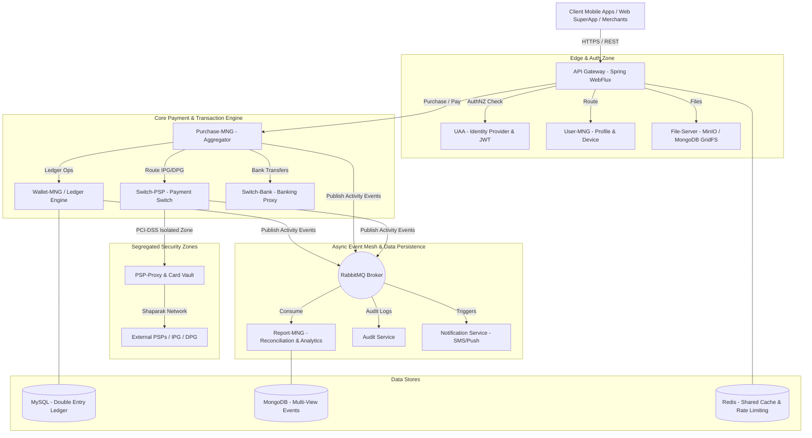
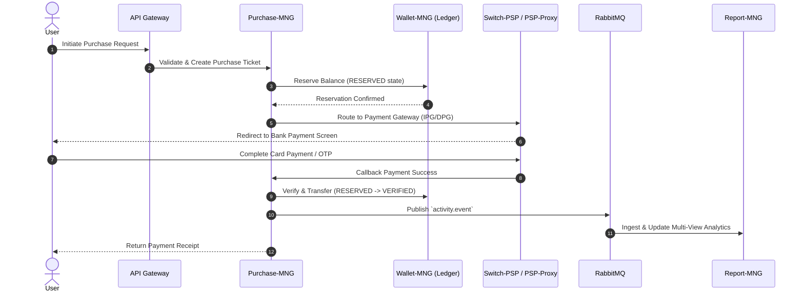
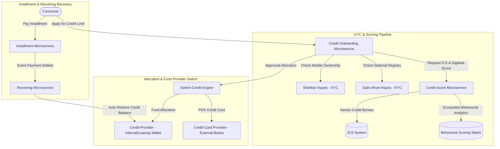
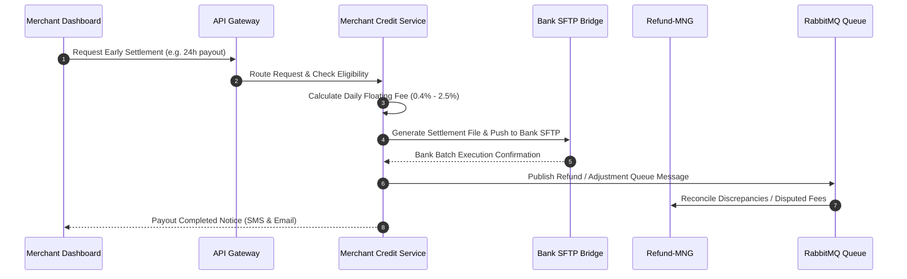
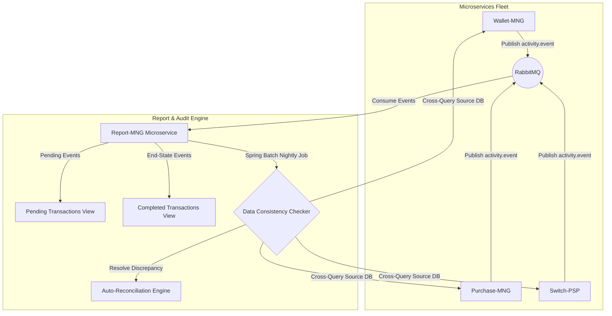

# Architecture Blueprint: High-Scale Iranian Fintech Microservices System Design
## راهنمای جامع معماری سیستم و مایکروسرویس‌های فین‌تک مقیاس‌بالا

**Target Publication**: [ariya-sarrafzadeh.ir](https://ariya-sarrafzadeh.ir)  
**Author**: Ariya Sarrafzadeh  
**Language**: English & Farsi (فارسی و انگلیسی)  
**Topics**: Fintech Architecture, Microservices, Event-Driven Systems, Payment Gateways, Wallet Ledgers, BNPL, eKYC, Iranian Financial Infrastructure  

---

## 📌 Executive Summary / چکیده مدیریتی

### English
Understanding the internal mechanics of high-throughput Iranian fintech platforms is a major challenge for 80%+ of software engineers and architects in the ecosystem due to closed documentation and proprietary implementations. This technical guide provides an exhaustive, production-grade architectural breakdown of a enterprise-scale Iranian fintech ecosystem (powering SuperApps, Wallet Ledgers, Smart Payment Switches, BNPL Credit Engine, Merchant Settlement, and eKYC). 

It details how dozens of Spring Boot / WebFlux microservices co-work asynchronously via RabbitMQ and synchronously via REST/gRPC, managing state consistency across Redis, MongoDB, MySQL, and isolated PCI-DSS payment zones.

### فارسی
فهم عمیق سازوکار داخلی و نحوه تعامل مایکروسرویس‌ها در پلتفرم‌های فین‌تک پرتردد ایرانی، برای بیش از ۸۰ درصد از مهندسان و معماران نرم‌افزار به دلیل کمبود مستندات عمومی شفاف، یک چالش بزرگ است. این مقاله تخصصی یک کالبدشکافی جامع و سطح بالا از معماری پلتفرم‌های فین‌تک کشور (پشتیبانی‌کننده از سوپراپ‌ها، کیف پول دفتری دوطرفه، سوییچ هوشمند پرداخت، اعتبارسنجی و BNPL، تسویه زودتر از موعد مرچنت‌ها و eKYC) ارائه می‌دهد.

در این مستند، نحوه هم‌آفرینی و تعامل ده‌ها مایکروسرویس مبتنی بر Spring Boot و Spring WebFlux به صورت سنکرون (REST) و آسنکرون (RabbitMQ) و حفظ یکپارچگی داده‌ها روی Redis، MongoDB، MySQL و زون‌های امنیتی شاپرک/بانکی به زبان فارسی و انگلیسی تشریح شده است.

---

## 🏛️ 1. High-Level System Topology / سیستم و توپولوژی کلی



---

## 🔑 2. Edge Layer & Security Zone / لایه ورودی و امنیت

### English
1. **API Gateway (Spring Cloud Gateway / WebFlux)**: Serves as the single edge entry point for millions of incoming requests from iOS, Android, and Web clients. It handles:
   - **Dynamic Routing**: Maps incoming endpoints to underlying microservices.
   - **Authentication Delegation**: Offloads authentication token verification to the UAA service.
   - **Authorization Verification**: Evaluates permissions returned by UAA; issues HTTP 403 Forbidden if permissions are lacking.
   - **Rate Limiting**: Uses Redis token bucket counters to block abusive traffic with HTTP 429 Too Many Requests.
2. **UAA (User Authentication & Authorization)**: Federated Identity Provider (IDP) issuing stateless, signed JWT tokens containing embedded scope and user permissions.
   - **Ticket AuthNZ**: Generates transactional single-use authorization tickets for financial actions.
   - **Multi-Tenant Roles**: Manages permissions across regular consumers, enterprise merchants, and internal operations staff.

### فارسی
۱. **ای‌پاد گیت‌وی (API Gateway)**: به‌عنوان نقطه ورود واحد تمام درخواست‌های موبایل و وب عمل می‌کند:
   - **مسیریابی پویا**: هدایت درخواست‌ها به سرویس مربوطه.
   - **تفویض احراز هویت (Authentication Delegation)**: ارجاع بررسی هویت به سرویس UAA.
   - **بررسی دسترسی (Authorization)**: عدم اجازه ادامه پردازش و ارجاع HTTP 403 در صورت نداشتن دسترسی.
   - **محدودکننده نرخ (Rate Limiter)**: جلوگیری از حملات و ترافیک غیرمجاز با پاسخ HTTP 429 با تکیه بر کش Redis.
۲. **سرویس UAA**: ایفاگر نقش **Federated Identity Provider** با صدور توکن‌های بی‌حالت (Stateless JWT) حاوی نقش‌ها و دسترسی‌ها، بدون نیاز به استعلام دیتابیس در هر فراخوانی.

---

## 💳 3. Double-Entry Wallet Ledger & Payments / کیف پول دفتری و پردازش پرداخت

### English
Financial integrity requires a **Double-Entry Ledger Architecture** adhering to strict ACID principles:
- **Two-Phase Balance Reservation**: When a payment begins, funds shift from `AVAILABLE` to `RESERVED` balance type. Upon merchant verification/completion, funds move from `RESERVED` to the destination target wallet.
- **Idempotent Deposit Operations**: All ledger operations require a unique `trackingCode`. Duplicate execution attempts with the same tracking code immediately return the cached result without re-executing credit/debit logic.
- **Multi-Bucket Wallets**: Supports distinct balances within a single user account (e.g., withdrawable cash vs non-withdrawable promotional/cashback balance).



### فارسی
ضمانت صحت داده‌های مالی نیازمند **معماری دفترداری دوبل (Double-Entry Ledger)** است:
- **رزرو دو مرحله‌ای موجودی**: هنگام شروع تراکنش، مبلغ ابتدا از نوع موجودی `AVAILABLE` به `RESERVED` منتقل می‌شود. پس از تایید نهایی، مبلغ به کیف پول مقصد واریز می‌گردد.
- **عملیات ایدامپوتنت (Idempotency)**: تمام واریزها و برداشت‌ها دارای شناسه یکتای `trackingCode` هستند؛ درخواست‌های تکراری بدون اجرای مجدد محاسبات مالی، نتیجه قبلی را بازمی‌گردانند.
- **موجودی چندبخشی**: تفکیک موجودی قابل برداشت از اعتبارات غیرقابل برداشت و هدیه در یک شناسه کاربری.

---

## 🔀 4. Smart Payment Switch & Security Isolation / سوییچ پرداخت و زون امنیتی

```mermaid
graph LR
    subgraph Core Network Zone
        PurchaseMNG[Purchase / Bill / TopUp Services] -->|Request Payment Route| SwitchPSP[Switch-PSP]
        HealthCheck[Health-Check Service] -->|Dynamic Status & Ping| SwitchPSP
        SwitchPSP -->|Select Terminal/PSP| PSPProxyZone[PSP Proxy Zone]
    end

    subgraph PSP Segregated Zone (PCI-DSS)
        PSPProxyZone -->|Encrypt Card PAN| Vault[Vault-Coordinator / Digipay-Vault]
        PSPProxyZone -->|Format PSP API| ExtPSP1[Saman / SEP]
        PSPProxyZone -->|Format PSP API| ExtPSP2[Parsian / PEC]
        PSPProxyZone -->|Format PSP API| ExtPSP3[Mellat / BPM]
    end
```

### English
- **Switch-PSP**: Intelligent routing engine selecting the optimal PSP terminal based on real-time health checks, success rates, dynamic fee limits, and terminal merchant configurations.
- **PSP-Proxy Isolation Zone**: Deployed in a dedicated, isolated network zone. Translates internal payment contracts into specific bank/PSP API formats while securing card data via End-to-End Primary Account Number (PAN) encryption.
- **Vault Coordinator & Card Vault**: Encrypts sensitive bank card details using hardware/software security keys before persisting tokenized indices in MongoDB/Redis.

### فارسی
- **سوییچ پرداخت (Switch-PSP)**: انتخاب هوشمندانه بهترین درگاه پرداخت (PSP) بر اساس پینگ زنده، نرخ موفقیت لحظه‌ای، کارمزدها و تنظیمات صنف مرچنت.
- **زون اختصاصی PSP-Proxy**: مستقر در زون ایزوله شبکه؛ ترجمه API‌های اختصاصی بانک‌ها (سامان، پارسیان، ملت، پاسارگاد) و رمزنگاری مبدأ تا مقصد شماره کارت (PAN Encryption).
- **والت کوئوردیناتور (Vault-Coordinator)**: تبدیل کارت‌های بانکی به توکن‌های امن رمزنگاری‌شده جهت جلوگیری از ذخیره مستقیم اطلاعات حساس کارت.

---

## 📑 5. BNPL & Consumer Credit Engine / موتور اعتبار خرد و خرید قسطی (BNPL)



### English
1. **Loan Origination (`Credit-Onboarding`)**: Orchestrates the multi-step user credit journey (`Allocation Process Step Handler`), dynamically toggling required steps (document upload, collateral check, manual operations review).
2. **Dual-Scoring Matrix (`Credit-Score`)**: Combines national bank credit history (ICS score for bounced cheques/defaults) with internal ecosystem behavioral data to determine exact credit limits.
3. **Revolving Credit Limit (`Revolving`)**: Automatically recalculates and restores the user's available credit line in real-time as monthly installments are paid off.

### فارسی
۱. **تشکیل پرونده اعتباری (`Credit-Onboarding`)**: مدیریت هوشمند فرآیند چندمرحله‌ای درخواست اعتبار، بارگذاری مدارک، بررسی چک و سفته، و تایید کارشناسان عملیات.
۲. **ماتریس اعتبارسنجی دوگانه (`Credit-Score`)**: ترکیب استعلام اعتبارسنجی بانکی کشور (سامانه ICS برای بررسی سابقه چک برگشتی و تسهیلات) با رفتارسنجی خریدهای قبلی کاربر در اکوسیستم.
۳. **ترمیم سقف اعتبار (`Revolving`)**: بازگردانی خودکار سقف اعتبار کاربر به محض پرداخت هر قسط توسط سرویس Revolving.

---

## 🏢 6. Merchant Early Settlement (`Merchant Credit`) / تسویه زودتر از موعد فروشندگان



### English
E-commerce merchants can unlock their pending sales liquidity within 24 hours (ahead of standard Shaparak settlement schedules) based on dynamic daily floating rates. The `Merchant Credit` service automates bank account creation and daily settlement batch files over secure SFTP bridges (e.g., Iran-Venezuela Bank SFTP), handling fee calculations and disputes via RabbitMQ and `Refund-MNG`.

### فارسی
فروشندگان می‌توانند وجوه حاصل از فروش خود را ظرف کمتر از ۲۴ ساعت (پیش از سیکل تسویه شاپرک) با احتساب کارمزد روزشمار دریافت کنند. سرویس `Merchant Credit` فرآیند ارسال فایل‌های تسویه به بانک را از طریق درگاه‌های SFTP خودکار کرده و مغایرت‌ها را به صورت آسنکرون از طریق RabbitMQ و `Refund-MNG` مدیریت می‌کند.

---

## 🔍 7. eKYC & Digital Signatures / احراز هویت دیجیتال و امضای الکترونیک

### English
- **KYC Service**: Provides direct integration with national databases:
  1. **Shahkar Inquiry**: Validates matching between national ID numbers and mobile phone SIM ownership (returning exact binary true/false matches).
  2. **Sabt-Ahval Inquiry**: Fetches identity metadata (full name, birthdate, vitality status).
  3. **Postal Address Inquiry**: Resolves postcodes into exact street and door numbers.
  4. **Liveness Check & Cheque Inquiry**: Verifies biometric liveness and cheque validity.
- **Digital-Signature & DSP**: Manages PKI certificate issuance, contract template rendering, and legally binding digital document signing.

```mermaid
graph LR
    User([User Application]) -->|Registration Request| DS[Digital-Signature Service]
    DS -->|Submit Video & ID| KYC[KYC Microservice]
    KYC -->|Shahkar Match| ShahkarApi[(Shahkar Registry)]
    KYC -->|Sabt Ahval Inquiry| SabtAhvalApi[(Sabt-Ahval Registry)]
    KYC -->|Liveness Check| LivenessEngine[(Biometric Engine)]
    KYC-->>DS: eKYC Verification Passed
    DS -->|Issue PKI Certificate| DSP[DSP - Digital Signature Provider]
    DSP -->|Store Document & Stamp| FileServer[File-Server / MinIO]
```

### فارسی
- **سرویس KYC**: متصل به سامانه‌های حاکمیتی جهت استعلام شاهکار (تطابق شماره ملی و مالکیت سیم‌کارت)، استعلام ثبت احوال، کد پستی، استعلام وضعیت چک و زنده‌سنجی بیومتریک (Liveness Check).
- **سرویس امضای دیجیتال (Digital-Signature & DSP)**: صدور گواهی امضای الکترونیک بر پایه کلید عمومی (PKI) و امضای دیجیتالی اسناد و قراردادهای تسهیلات اعتباری.

---

## 📊 8. Event Consistency & Reconciliation Engine / پایش و مغایرت‌گیری داده‌ها



### English
In a distributed microservices environment, immediate consistency across all read models is unfeasible. The architecture uses **Eventual Consistency**:
1. All domain services emit `activity.event` messages upon state changes to **RabbitMQ**.
2. **Report-MNG** ingests these messages and maintains segregated read views (App View & Admin Dashboard View).
3. A **Data Consistency Checker** (built with **Spring Batch**) executes automated nightly and weekly cross-checks against source database ledgers, identifying discrepancies and executing auto-healing refund or debit workflows via `Refund-MNG`.

### فارسی
در سیستم‌های توزیع‌شده فین‌تک، **پایداری نهایی (Eventual Consistency)** از طریق صف پیام پیاده‌سازی می‌شود:
۱. تمام سرویس‌ها پس از تغییر وضعیت، رویدادها را روی صف **RabbitMQ** منتشر می‌کنند.
۲. سرویس **Report-MNG** رویدادها را دریافت کرده و نمای اطلاعاتی سوپراپ و دشبورد مدیریتی را بروزرسانی می‌کند.
۳. **مغایرت‌گیر خودکار**: بسته‌های اسکریپت شبانه و هفتگی **Spring Batch** داده‌های گزارشات را با دیتابیس سرویس‌های مبدأ تطبیق داده و در صورت وجود ناهمخوانی، دستورات اصلاحی را به سرویس `Refund-MNG` صادر می‌کنند.

---

## 💡 Summary Checklist for Iranian Fintech Architects
- [x] **Segregate PCI-DSS / PSP networks** from core business logic using proxy workers.
- [x] **Enforce idempotency** across all ledger debit/credit endpoints using strict tracking keys.
- [x] **Implement two-phase reservations** (`RESERVED` -> `VERIFIED`) to handle network timeouts safely.
- [x] **Isolate session & token logic** to stateless JWTs to reduce database load at the edge.
- [x] **Decouple audit and analytics** via asynchronous event streams (RabbitMQ) to maximize transactional throughput.

---
*Published as an open technical resource for the Iranian Fintech & Software Engineering Community at [ariya-sarrafzadeh.ir](https://ariya-sarrafzadeh.ir).*
