# High-Scale Iranian Fintech Microservices Architecture: The Production Blueprint
## راهنمای جامع و مرجع معماری میکروسرویس‌های فین‌تک در مقیاس سازمانی

**Author:** Ariya Sarrafzadeh  
**Domain:** [ariya-sarrafzadeh.ir](https://ariya-sarrafzadeh.ir)  
**Target Audience:** Fintech Product Managers, Software Architects, Lead Backend Engineers, and FinTech Builders  
**Topics:** Iranian Payment Rails, Shaparak, Double-Entry Wallet Ledger, BNPL & Credit Engine, Smart PSP Switch, eKYC, Automated Merchant Early Settlement  
**Languages:** English & Persian (فارسی و انگلیسی)  

---

## 📑 Table of Contents / فهرست مطالب
1. [Executive Summary / چکیده مدیریتی](#1-executive-summary--چکیده-مدیریتی)
2. [Why Iranian Fintech Architecture is Hard / چرا مهندسی فین‌تک در ایران پیچیده است؟](#2-why-iranian-fintech-architecture-is-hard--چرا-مهندسی-فین‌تک-در-ایران-پیچیده-است)
3. [End-to-End System Topology / توپولوژی کلان سیستم](#3-end-to-end-system-topology--توپولوژی-کلان-سیستم)
4. [Edge Gateway & Stateless Ticket AuthNZ / لایه ورودی و اعتبارسنجی تیکت‌محور](#4-edge-gateway--stateless-ticket-authnz--لایه-ورودی-و-اعتبارسنجی-تیکت‌محور)
5. [The Double-Entry Wallet Ledger Engine / موتور دفتر کل کیف پول با بالانس دوبل](#5-the-double-entry-wallet-ledger-engine--موتور-دفتر-کل-کیف-پول-با-بالانس-دوبل)
6. [Smart PSP Payment Switch & Network Isolation / سوییچ هوشمند پرداخت و زون ایزوله بانکی](#6-smart-psp-payment-switch--network-isolation--سوییچ-هوشمند-پرداخت-و-زون-ایزوله-بانکی)
7. [Purchase Engine & Dynamic Fee Split / موتور خرید و تسهیم پویا](#7-purchase-engine--dynamic-fee-split--موتور-خرید-و-تسهیم-پویا)
8. [BNPL & Consumer Credit Origination / زیرساخت اعتباری، اعتبارسنجی و BNPL](#8-bnpl--consumer-credit-origination--زیرساخت-اعتباری-اعتبارسنجی-و-bnpl)
9. [Installment Lifecycle & Revolving Limits / چرخه بازپرداخت اقساط و ترمیم سقف اعتبار](#9-installment-lifecycle--revolving-limits--چرخه-بازپرداخت-اقساط-و-ترمیم-سقف-اعتبار)
10. [National Banking Rails & Direct Debit / زیرساخت سوئیچ بانکی، پایا، ساتنا و دایرکت دبیت](#10-national-banking-rails--direct-debit--زیرساخت-سوئیچ-بانکی-پایا-ساتنا-و-دایرکت-دبیت)
11. [Merchant Early Settlement & Working Capital Finance / تسویه زودتر از موعد فروشندگان و تأمین مالی](#11-merchant-early-settlement--working-capital-finance--تسویه-زودتر-از-موعد-فروشندگان-و-تأمین-مالی)
12. [Government eKYC & PKI Digital Signature / احراز هویت شاهکار، ثبت احوال و امضای دیجیتال](#12-government-ekyc--pki-digital-signature--احراز-هویت-شاهکار-ثبت-احوال-و-امضای-دیجیتال)
13. [Event-Driven Reconciliation & Auto-Healing / پایش مغایرت‌های مالی و پایداری نهایی با Spring Batch](#13-event-driven-reconciliation--auto-healing--پایش-مغایرت‌های-مالی-و-پایداری-نهایی-با-spring-batch)
14. [Product Manager's Operations & SLA Matrix / راهنمای عملیاتی و شاخص‌های کلیدی مدیر محصول](#14-product-managers-operations--sla-matrix--راهنمای-عملیاتی-و-شاخص‌های-کلیدی-مدیر-محصول)

---

## 1. Executive Summary / چکیده مدیریتی

### English
In high-throughput e-commerce and fintech ecosystems, handling financial transactions with sub-second latencies while guaranteeing strict zero-discrepancy financial accounting is an engineering feat. In Iran, this challenge is intensified by unique regulatory networks (Shaparak, Faravaran Hub, Central Bank Paya/Satna clearing rails, Harim dynamic OTP systems), intermittent connectivity, and strict compliance boundaries.

This document serves as an exhaustive, battle-tested architectural blueprint modeled after enterprise-grade Iranian payment super-apps and financial platforms. It details how dozens of Spring Boot microservices cooperate through synchronous REST/gRPC interfaces and asynchronous RabbitMQ event meshes, maintaining state across MySQL, MongoDB, and Redis clusters while guaranteeing zero data loss, audit-trail compliance, and high availability.

### فارسی
در پلتفرم‌های تجارت الکترونیک و سوپراپ‌های مالی با تراکنش‌های میلیونی، پردازش بلادرنگ همراه با خطای صفر در تراز مالی، از دشوارترین چالش‌های مهندسی نرم‌افزار است. این پیچیدگی در کشور ایران به علت اتصال به شبکه‌های انحصاری قانون‌گذار (شاپرک، هاب فناوران، تسویه پایا و ساتنا، سامانه رمز دوم پویای هریم، شاهکار و ثبت‌احوال) و محدودیت‌های ارتباطی، دوچندان می‌شود.

این مرجع تخصصی، معماری تولیدی یک اکوسیستم مقیاس‌پذیر فین‌تک ایرانی را تشریح می‌کند. در این مستند بررسی می‌کنیم که چگونه ده‌ها مایکروسرویس مبتنی بر اکوسیستم جاوا (Spring Boot / Spring WebFlux) از طریق ارتباطات سنکرون و مش رویدادمحور بر بستر RabbitMQ با دیتابیس‌های چندگانه (MySQL برای دفتر کل مالی، MongoDB برای اسناد و رویدادها، Redis برای کشینگ و قفل توزیع‌شده) تعامل کرده و ضمن حفظ محرمانگی کامل داده‌ها (PCI-DSS)، پایداری نهایی و مانیتورینگ دقیق تراکنش‌ها را محقق می‌سازند.

---

## 2. Why Iranian Fintech Architecture is Hard / چرا مهندسی فین‌تک در ایران پیچیده است؟

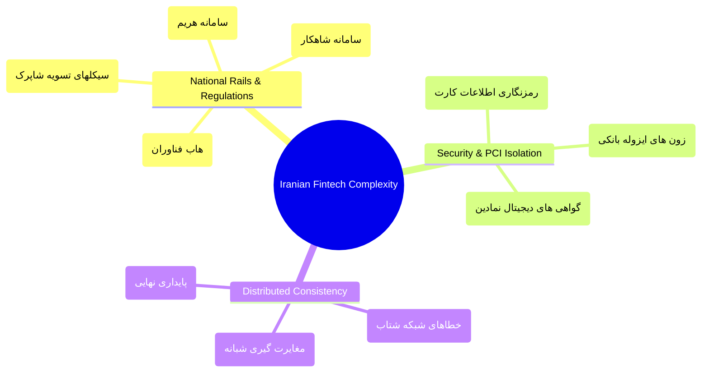

1. **Disconnected Sandbox vs. Production Realities:** Western systems rely on unified interfaces (Stripe, Plaid, Adyen). In Iran, every Payment Service Provider (PSP)—such as Saman (SEP), Parsian (PEC), Mellat (BPM), and Pasargad (PEP)—has disparate, legacy protocols, irregular error codes, and independent timeout behaviors.
2. **Two-Stage Settlement & Reconciliation:** Money does not settle in real time; it transitions through national clearing houses (Paya cycles: ~03:45, 10:45, 13:45, 18:45). The system must maintain stateful pending transaction queues and automatic reconciliation engines to detect ledger discrepancies.
3. **Strict Network & Card Data Segregation:** To comply with security mandates, raw card credentials (PAN, CVV2, Expiry) must never touch standard application databases. They must be tokenized, re-encrypted, and channeled exclusively within isolated bank-adjacent network zones.

---

## 3. End-to-End System Topology / توپولوژی کلان سیستم

The ecosystem separates public ingress, domain logic, identity, payment proxying, and analytics into clearly delineated microservice domains:

```mermaid
graph TB
    subgraph Client Tier / کلاینت ها
        MobileApp[Mobile SuperApp - Android / iOS]
        WebPortal[Merchant & Consumer Web Portals]
        ThirdParty[External B2B Merchants]
    end

    subgraph Edge & Security Tier / لایه ورودی و امنیت
        Gateway[API Gateway - Spring Cloud Gateway]
        UAA[UAA - Identity Provider & OAuth2/JWT]
        ConfigServer[Config-Server - Spring Cloud / Git]
        ScheduleMNG[Schedule-MNG - Distributed Quartz]
    end

    subgraph Core Payment & Ledger / تراکنش و دفترداری
        PurchaseMNG[Purchase-MNG - Orchestrator]
        WalletMNG[Wallet-MNG - Wallet Domain]
        Ledger[Wallet Provider / Double-Entry Ledger]
        SwitchPSP[Switch-PSP - Payment Switch Engine]
        RefundMNG[Refund-MNG - Refund Lifecycle Engine]
    end

    subgraph Isolated Bank Zone / زون ایزوله پردازش بانکی
        Vault[Vault Coordinator & Card Vault]
        PSPProxy[PSP-Proxy Multi-Instance Cluster]
        BankProxy[Bank-Proxy - ACH / RTGS / Direct Debit]
    end

    subgraph Credit & BNPL / موتور اعتباری و اقساط
        CreditOnboard[Credit-Onboarding - Loan Origination]
        CreditScore[Credit-Score - ICS & Ecosystem Matrix]
        SwitchCredit[Switch-Credit - Provider Switch]
        CreditProvider[Credit-Provider - In-House BNPL]
        InstallmentMNG[Installment-MNG - Repayment Engine]
        RevolvingMNG[Revolving-MNG - Credit Restorer]
    end

    subgraph Enterprise Financial Services / خدمات مکمل مرچنت
        MerchantCredit[Merchant-Credit - 24h Early Settlement]
        PDY[PDY - Shaparak Payment Facilitator]
        KYC[KYC Engine - Shahkar & Sabt-Ahval]
        DSP[DSP - Digital Signature PKI]
    end

    subgraph Asynchronous Infrastructure / گذرگاه رویداد و داده
        RabbitMQ((RabbitMQ Enterprise Cluster))
        ReportMNG[Report-MNG - Spring Batch Analytics]
        Audit[Audit Service - Immutable Log]
        Notification[Notification - Multi-Provider SMS/Push]
    end

    %% Ingress Flow
    MobileApp & WebPortal & ThirdParty -->|HTTPS / WSS| Gateway
    Gateway -->|AuthNZ Delegation| UAA
    Gateway -->|Route Traffic| PurchaseMNG
    Gateway -->|Route Traffic| WalletMNG
    Gateway -->|Route Traffic| CreditOnboard
    Gateway -->|Route Traffic| MerchantCredit

    %% Payment Interconnections
    PurchaseMNG -->|Reserve / Commit| WalletMNG
    WalletMNG -->|Double Entry Entries| Ledger
    PurchaseMNG -->|Route Payment| SwitchPSP
    SwitchPSP -->|Encrypted Dispatch| PSPProxy
    PSPProxy -->|Tokenize Cards| Vault

    %% BNPL Interconnections
    CreditOnboard -->|Identity Verification| KYC
    CreditOnboard -->|Dual Scoring| CreditScore
    CreditOnboard -->|Provision Credit Line| SwitchCredit
    SwitchCredit -->|Allocate| CreditProvider
    InstallmentMNG -->|On Successful Repay| RevolvingMNG
    RevolvingMNG -->|Restore Credit| CreditProvider

    %% Async Telemetry & Events
    PurchaseMNG & WalletMNG & SwitchPSP & InstallmentMNG -->|Publish `activity.event`| RabbitMQ
    RabbitMQ -->|Consume| ReportMNG
    RabbitMQ -->|Consume| Notification
    RabbitMQ -->|Audit Trails| Audit
```

---

## 4. Edge Gateway & Stateless Ticket AuthNZ / لایه ورودی و اعتبارسنجی تیکت‌محور

### English
The Edge Layer handles millions of inbound calls and protects backend services from malformed traffic, DDoS vectors, and authorization leaks.

#### Key Architectural Components
1. **API Gateway (Spring Cloud Gateway / WebFlux):**
   - **Reactive Non-Blocking Routing:** Asynchronous Netty runtime capable of maintaining tens of thousands of concurrent persistent connections with minimal memory overhead.
   - **Distributed Rate Limiting:** Enforces token-bucket rate limiting backed by Redis. Abusive IPs or client IDs receive HTTP `429 Too Many Requests`.
   - **Zero-Trust Delegation:** Extracts incoming JWT tokens and passes validation claims to the UAA.
2. **UAA (User Authentication & Authorization):**
   - **Stateless JWT Authority:** Emits cryptographically signed, stateless JSON Web Tokens. Access tokens encapsulate claims (User UUID, scopes, tenant profile, verified level, permissions array), completely eliminating database read-amplification on routine API calls.
   - **Transactional Ticket AuthNZ:** For critical write operations (such as initiating a 50,000,000 IRR payment), the gateway requires a short-lived, single-use signed ticket. Once executed, the ticket is burned via Redis atomic `GETDEL` operations, guaranteeing immunity against replay attacks.

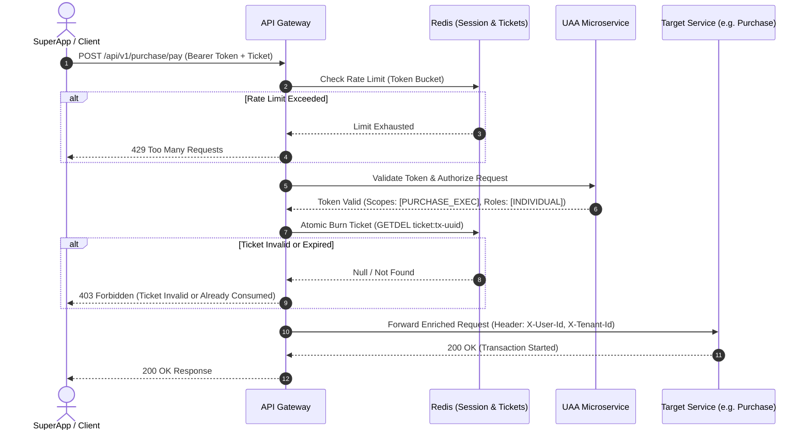

### فارسی
لایه ورودی (Edge Layer) وظیفه مهار بار ترافیکی و بررسی امنیتی درخواست‌ها را بدون ایجاد سربار روی سرویس‌های هسته بر عهده دارد:
- **مسیریابی غیرهمگام (Reactive Routing):** مبتنی بر Spring WebFlux برای مدیریت ارتباطات همزمان بالا.
- **محدودسازی نرخ (Rate Limiting):** بر پایه الگوریتم Token Bucket و کش Redis جهت حفاظت از سیستم در برابر حملات داس و ارسال خطای `429 Too Many Requests`.
- **توکن‌های بدون حالت (Stateless JWT):** اطلاعات نقش‌ها، سطوح احراز هویت و دسترسی کاربر درون پی‌لود توکن رمزگذاری شده تا نیاز به کوئری زدن مداوم به دیتابیس در هر فراخوانی از بین برود.
- **تیکت‌های یک‌بارمصرف تراکنشی (Transactional Tickets):** در عملیات با ریسک مالی بالا، کلاینت پیش از انجام تراکنش تیکت معتبری دریافت می‌کند که با استفاده از دستور اتمیک `GETDEL` ردیس در حین اولین پردازش بلافاصله سوزانده می‌شود تا از حملات تکرار (Replay Attacks) جلوگیری به عمل آید.

---

## 5. The Double-Entry Wallet Ledger Engine / موتور دفتر کل کیف پول با بالانس دوبل

### English
A robust fintech platform cannot rely on a naive `balance = balance - amount` database schema. Doing so risks race conditions, phantom reads, and audit failure. The wallet architecture utilizes an **Immutable Double-Entry Ledger (ACID)** paired with a **Two-Phase Reservation State Machine**.

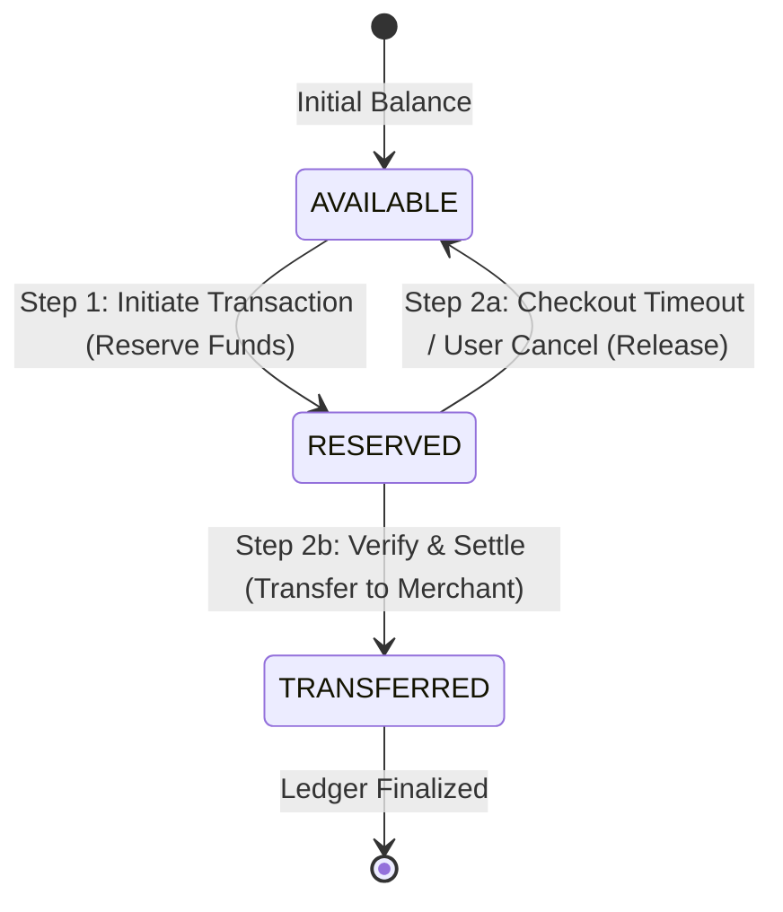

#### Core Ledger Invariants
1. **Double-Entry Principle:** Every movement of funds is stored as at least two journal records: a `DEBIT` from one balance bucket and a `CREDIT` to another. The net sum across the entire system ledger is always strictly equal to zero:
   $$\sum \text{Debits} + \sum \text{Credits} = 0$$
2. **Two-Phase Balance Reservation:**
   - **Phase 1 (Reserve):** Funds shift from the user's `AVAILABLE` bucket to their `RESERVED` bucket. The user cannot spend these funds elsewhere, but they have not yet departed the account.
   - **Phase 2 (Commit or Abort):** Upon receiving a signed callback from the downstream merchant or payment gateway, the engine executes `VERIFY`. Funds in `RESERVED` are burned and credited to the merchant’s enterprise wallet. If an error occurs, funds transition from `RESERVED` back to `AVAILABLE`.
3. **Idempotency Key Enforcement:** Every mutation requires an immutable `trackingCode` or `idempotencyKey`. Duplicate inbound calls retrieve the exact existing record from Redis/MySQL rather than re-executing credit/debit arithmetic.
4. **Segregated Balance Types:**
   - `CASH`: Deposited via bank card; fully cashoutable to national IBAN (Sheba).
   - `INTERNAL_CREDIT`: Cashback, promo coins, or organizational vouchers; non-cashoutable, restricted to in-network merchant purchases.

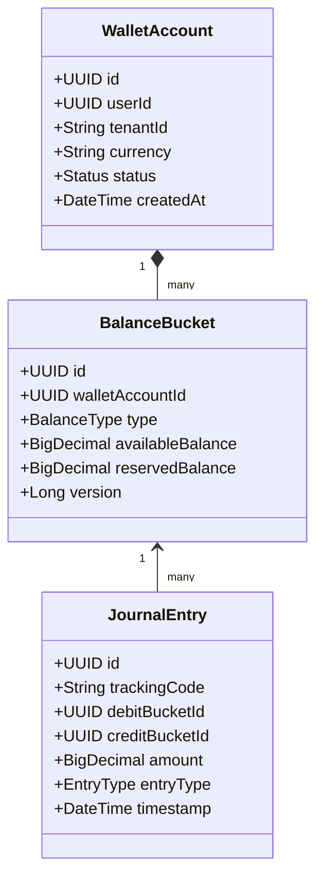

### فارسی
حفظ انضباط مالی پلتفرم مستلزم پیاده‌سازی **دفتر کل دوبل تغییرناپذیر (Immutable Double-Entry Ledger)** و پرهیز از تغییر مستقیم فیلد موجودی است:
- **اصل تراز صفر:** هر جابجایی وجه، شامل حداقل دو ردیف سند حسابداری است (بدهکار/بستانکار). مجموع خالص تمام اسناد در سیستم همواره برابر با صفر است.
- **تخصیص دومرحله‌ای موجودی (Two-Phase Balance):** ابتدا وجه از بالانس `AVAILABLE` کاربر خارج و وارد وضعیت `RESERVED` می‌شود. تنها پس از فراخوانی موفق متد `verify` توسط پذیرنده، وجه از وضعیت رزرو کسر و به کیف پول پذیرنده واریز می‌‌گردد. در صورت شکست یا انقضای زمان، وجه بدون فوت وقت به موجودی در دسترس بازگردانده می‌شود.
- **ضمانت اجراپذیری مکرر (Idempotency):** کلیه فرآیندها با کلید یکتای `trackingCode` کنترل می‌شوند تا بروز تاخیر شبکه یا ارسال مجدد درخواست توسط کلاینت منجر به تکرار تراکنش نشود.
- **تفکیک ماهیت دارایی (Balance Types):** تفکیک موجودی نقدی قابل برداشت (شارژ شده از شتاب) از اعتبارات غیرقابل برداشت حاصل از کمپین، کش‌بک، یا هدایای سازمانی.

---

## 6. Smart PSP Payment Switch & Network Isolation / سوییچ هوشمند پرداخت و زون ایزوله بانکی

### English
The Payment Switch abstracts downstream bank differences and selects the best payment route while maintaining strict security boundaries around Primary Account Number (PAN) data.

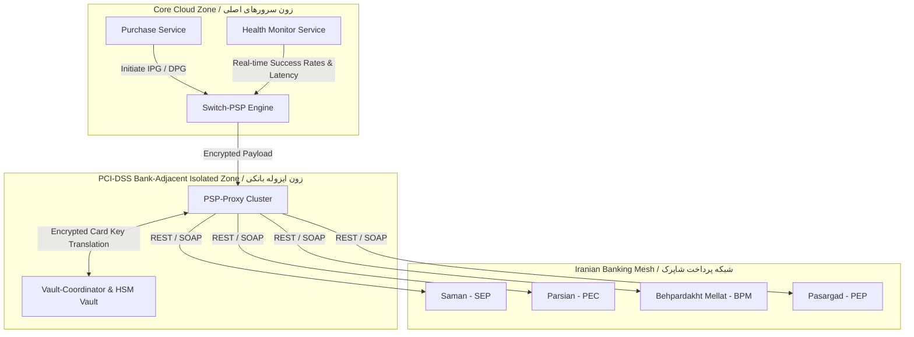

#### Architectural Deep-Dive
1. **Dynamic Smart Routing:** Rather than hardcoding PSP allocation, `Switch-PSP` calculates a dynamic weighted routing score for each available PSP every 30 seconds:
   $$\text{Score} = w_1 \cdot \text{SuccessRate}_{\text{5min}} + w_2 \cdot \frac{1}{\text{Latency}_{\text{avg}}} + w_3 \cdot \text{CostEfficiency}$$
   If a bank switch collapses during flash sales, traffic is seamlessly failed over within milliseconds.
2. **Two Payment Modes:**
   - **Internet Payment Gateway (IPG):** Traditional two-step payment. The customer is redirected to the Shaparak web view (`*.shaparak.ir`), enters credentials, and is redirected back with a token for verification.
   - **Direct Payment Gateway (DPG - 4-Parameters):** In-app web-service-based checkout. The app collects the card index or public-key-encrypted PAN, triggering the national Central Bank OTP service (Harim) through the bank proxy without forcing a redirect.
3. **End-to-End PAN Encryption & Key Rotation:** Card numbers captured in client apps are encrypted with an ephemeral public key issued by the PSP-Proxy. The Core Zone never sees or logs raw PAN data. Only the isolated PSP Proxy, protected inside an isolated network perimeter, possesses the private key to unseal and forward payment instructions to Shaparak.

### فارسی
سوئیچ پرداخت، یکتاساز کلیه درگاه‌های بانکی کشور با هوشمندی کامل در توزیع بار و حفاظت از کارت‌های شتابی کاربران است:
- **روتینگ هوشمند:** سوییچ با سنجش نرخ موفقیت، تاخیر زمانی (Latency) و کارمزدهای پذیرندگی در پنجره‌های زمانی ۵ دقیقه‌ای، پایدارترین درگاه را به کاربر اختصاص می‌دهد.
- **پشتیبانی از دو حالت پرداخت:**
  1. **درگاه اینترنتی (IPG):** کاربر به صفحات شاپرکی منتقل شده و فرآیند دو مرحله‌ای `Token -> Callback -> Verify` طی می‌شود.
  2. **پرداخت مستقیم ۴ پارامتری (DPG):** کاربر در داخل خود سوپراپ با استفاده از رمز دوم پویای پیامکی (هریم) پرداخت خود را بدون تغییر صفحه تکمیل می‌کند.
- **ایزولاسیون اطلاعات کارت بانکی:** شماره کارت‌های ورودی کلاینت با کلید عمومی (Public Key) زون بانکی رمزنگاری می‌شوند. سرورهای اصلی به شماره کارت خام دسترسی ندارند و تنها پروکسی مستقر در زون اختصاصی شبکه اجازه رمزگشایی و ارسال آن به درگاه PSP را دارد.

---

## 7. Purchase Engine & Dynamic Fee Split / موتور خرید و تسهیم پویا

### English
The `Purchase-MNG` service is the central transaction coordinator. It handles single-click checkouts, merchant commission calculations, and multi-party payment settlement (splits).

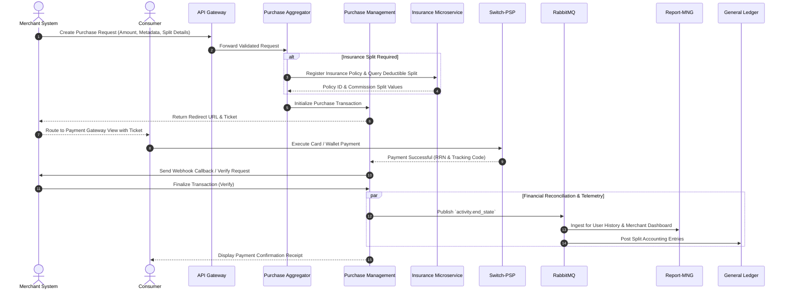

### فارسی
سرویس مدیریت خرید (`Purchase-MNG`) هماهنگ‌کننده کلیه مراحل پرداخت چندبخشی، استعلام بیمه، تیکت تراکنش و صدور اسناد حسابداری است:
1. **تسهیم پویا (Dynamic Commission Split):** تفکیک آنی مبلغ پرداختی میان سهم پذیرنده، کارمزد پلتفرم، سهم شرکت بیمه یا تامین‌کنندگان کالا به صورت قطعی در لحظه تسویه.
2. **اتصال به سیستم دفترداری کل (GL):** صدور اسناد حسابداری به ازای هر ریال جابجا شده و ثبت در سامانه مدیریت گزارشات (`Report-MNG`) از طریق رویدادهای `activity.event`.

---

## 8. BNPL & Consumer Credit Origination / زیرساخت اعتباری، اعتبارسنجی و BNPL

### English
The BNPL (Buy Now, Pay Later) and Consumer Credit framework transforms e-commerce conversions by automating loan origination, user credit scoring, and dynamic installment management without manual banking intervention.

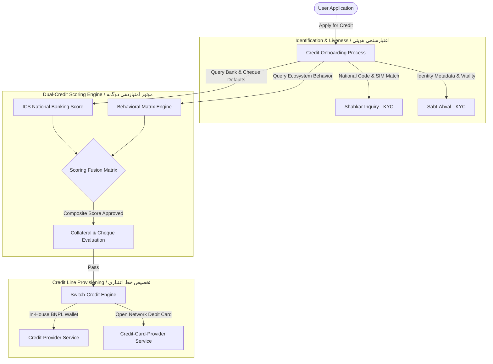

#### Dual Scoring Algorithm
Credit limits are derived from a unified risk function:
$$\text{CreditLimit} = f(\text{ICS}_{\text{BankingScore}}, \text{Score}_{\text{Ecosystem}}, \text{RiskCategory}_{\text{Merchant}})$$
- **ICS (Iran Credit Scoring):** National credit bureau checking for historical payment defaults, bad loans, and bounced cheques across all Iranian banks.
- **Ecosystem Behavioral Score:** Proprietary model evaluating historical purchase frequency, return rates, wallet turnover, and account longevity within Digikala and partner ecosystems.

### فارسی
زیرساخت اعتبار خرد و الان بخر، بعداً پرداخت کن (BNPL)، با خودکارسازی فرآیند تشکیل پرونده و اعتبارسنجی، تجربه خرید اقساطی بدون ضامن را فراهم می‌کند:
- **احراز هویت پیوسته (eKYC):** تطبیق سیستمی شماره ملی با سیم‌کارت از طریق شاهکار و دریافت مشخصات شناسنامه‌ای و زنده‌سنجی از ثبت‌احوال.
- **موتور ارزیابی اعتباری دوگانه:** ترکیب امتیاز بانکی کشور (سامانه اعتبارسنجی ایرانیان - ICS جهت بررسی معوقات و چک‌های برگشتی) با سابقه خرید و رفتار مالی کاربر در اکوسیستم دیجی‌کالا و کیف پول.
- **تفکیک پرووایدر اعتبار:** 
  - `credit-provider`: کیف پول اعتباری درون‌سازمانی با قابلیت خرج روی پذیرندگان منتخب اکوسیستم.
  - `credit-card-provider`: کارت‌های اعتباری متصل به شبکه شتاب بانکی برای خرید روی کلیه پایانه‌های فروشگاهی (POS) کشور.

---

## 9. Installment Lifecycle & Revolving Limits / چرخه بازپرداخت اقساط و ترمیم سقف اعتبار

### English
When a BNPL transaction completes, the system establishes a debt repayment contract. As users repay their debts, the **Revolving Engine** automatically re-expands their available credit ceiling in real time.

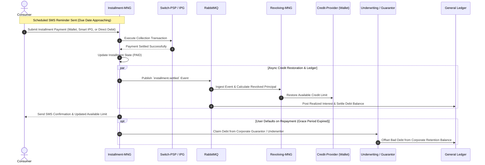

### فارسی
مدیریت اقساط شامل فرآیند سررسید، بازپرداخت از درگاه‌های متنوع و ترمیم خودکار خط اعتباری است:
- **ترمیم سقف اعتبار (Revolving Credit):** به محض پرداخت هر قسط توسط کاربر، بخش اصل بدهی تسویه شده بلافاصله توسط سرویس `Revolving` به سقف اعتبار فعال کاربر بازگردانده می‌شود تا نیازی به اعتبارسنجی مجدد نباشد.
- **پوشش ریسک از طریق ضامن سازمانی (Underwriter):** در صورت عدم پرداخت قسط در پایان دوره تنفس (Grace Period)، سرویس بدهی را از حساب تضمین‌کننده (سازمان متبوع کاربر یا شرکت‌های واسپاری/لیزینگ همکار) وصول می‌نماید.

---

## 10. National Banking Rails & Direct Debit / زیرساخت سوئیچ بانکی، پایا، ساتنا و دایرکت دبیت

### English
The `Switch-Bank` and `Bank-Proxy` subsystem provides direct programmatic access to the underlying national banking networks.

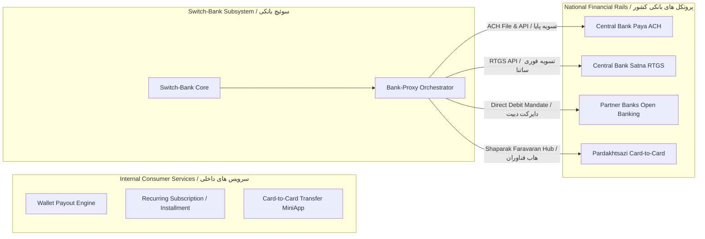

#### National Rail Capabilities
- **Paya (ACH):** Automated Clearing House for batch disbursements and wallet-to-bank cashouts. Executes in scheduled national cycles.
- **Satna (RTGS):** Real-Time Gross Settlement for high-value, instantaneous interbank balance transfers.
- **Direct Debit (Peyman / Bardasht-e Mostaghim):** Long-term digital contracts allowing the platform to deduct installment or subscription fees automatically from the consumer's bank account with zero user friction.
- **Card-to-Card (C2C Transfer via Faravaran Hub):** Leverages specialized Payment Creation (Pardakhtsazi) licenses from Shaparak to facilitate peer-to-peer card transfers with smart routing across bank switches.

### فارسی
سوئیچ خدمات بانکی (`Switch-Bank` و `Bank-Proxy`)، لایه انتزاعی ارتباط با زیرساخت‌های مالی کلان کشور است:
- **سامانه پایا (ACH):** انتقال وجه بین‌بانکی دسته‌ای و تسویه مانده کیف پول به شماره شبا در سیکل‌های معین بانک مرکزی.
- **سامانه ساتنا (RTGS):** انتقال فوری و ناخالص مبالغ کلان به مقاصد بانکی با پایداری آنی.
- **برداشت مستقیم (Direct Debit):** عقد قراردادهای برخط با مشتریان جهت کسر خودکار هزینه قبوض، اقساط یا اشتراک از حساب بانکی بدون نیاز به ورود مجدد رمز و اطلاعات کارت.
- **کارت به کارت (هاب فناوران شاپرک):** بهره‌برداری از مجوز رسمی پرداخت‌سازی شاپرک برای انجام تراکنش‌های C2C در سوپراپ با روتینگ هوشمند بین بانک‌های مبدا و مقصد.

---

## 11. Merchant Early Settlement & Working Capital Finance / تسویه زودتر از موعد فروشندگان و تأمین مالی

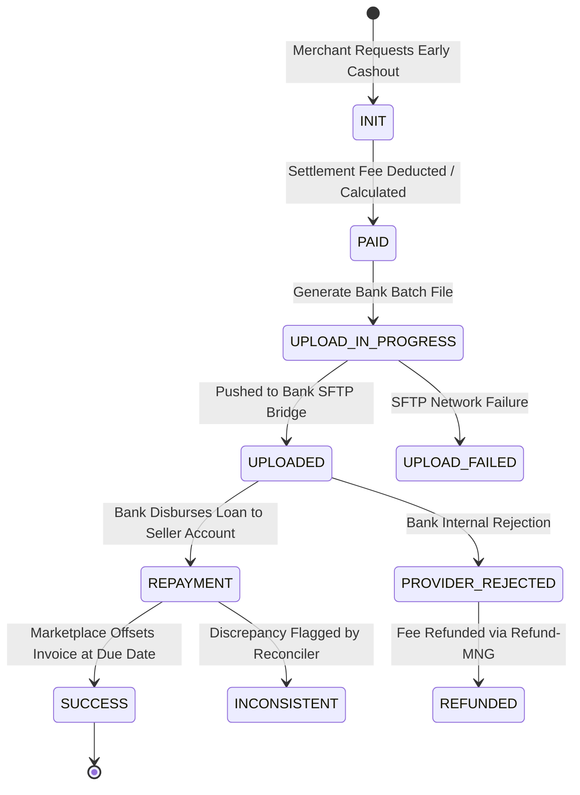

### English
Marketplace sellers often wait 15 to 45 days for standard accounting clearing. The `Merchant Credit` service unlocks their liquidity within 24 hours via automated working capital loans.

#### Architectural Mechanics
1. **Dynamic Floating Daily Fee:** The system applies a risk-adjusted discount factor:
   $$\text{Fee} = \text{InvoiceAmount} \cdot (r_{\text{base}} + d \cdot r_{\text{daily}})$$
   Where $d$ is days remaining until regular invoice settlement (e.g., 0.4% fee for 5 days; ~2.5% for 30 days).
2. **Automated Bank SFTP Batch Integration:** To integrate with traditional commercial banks without modern web APIs, a secure scheduler processes approved disbursements, encrypts settlement matrices into bank-specific formats, and streams them via SFTP bridges (e.g., Iran-Venezuela Bank integration).
3. **Dispute Resolution & Auto-Refund:** If the bank fails to disburse, or if invoice amounts are amended due to product returns, `Merchant Credit` publishes rollback compensation messages to `Refund-MNG` via RabbitMQ.

### فارسی
سرویس تسویه زودتر از موعد فروشندگان (`Merchant-Credit`) امکان دریافت نقدینگی فروش ظرف کمتر از ۲۴ ساعت را بر پایه مدل‌های تامین مالی زنجیره تامین (SCF) فراهم می‌آورد:
- **کارمزد روزشمار شناور:** محاسبه کارمزد بر اساس فاصله زمانی تا موعد طبیعی تسویه فاکتور (به عنوان مثال ۰.۴ درصد برای بازه ۵ روزه تا ۲.۵ درصد برای بازه‌های ۳۰ روزه).
- **پل ارتباطی امن SFTP با بانک‌های تجاری:** سیستم اسناد پرداخت تسهیلات را به صورت فایل‌های دسته‌ای رمزگذاری‌شده در ساعات مشخص به دایرکتوری‌های SFTP بانک‌ها ارسال و وضعیت تایید را پایش می‌کند.
- **رفع مغایرت و استرداد کارمزد (`Refund-MNG`):** در صورت رد تراکنش توسط بانک، کارمزد کسر شده به همراه مابه‌التفاوت به صورت خودکار و ناهمگام به حساب فروشنده عودت داده می‌شود.

---

## 12. Government eKYC & PKI Digital Signature / احراز هویت شاهکار، ثبت احوال و امضای دیجیتال

### English
To achieve legally binding, branchless consumer credit agreements, the system implements a modern Identity & PKI signing flow:

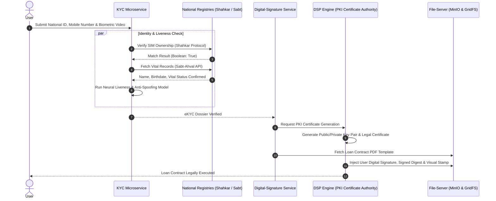

### فارسی
سامانه احراز هویت دیجیتال (eKYC) و امضای الکترونیک، جایگزین فرآیندهای سنتی کاغذی و شعب بانکی:
1. **استعلام شاهکار:** اعتبارسنجی انطباق کدملی با شماره سیم‌کارت به صورت دودویی (`true/false`).
2. **استعلام ثبت احوال:** دریافت مشخصات شناسنامه‌ای، سری و سریال شناسنامه و وضعیت حیات.
3. **احراز بیومتریک (Liveness Detection):** پردازش ویدئو و تصویر چهره جهت جلوگیری از تقلب هویتی (Anti-Spoofing).
4. **صدور گواهی PKI و امضای قرارداد (`DSP`):** صدور گواهی امضای دیجیتال مطابق با قوانین تجارت الکترونیک کشور و الصاق هش امضا و مهر دیجیتال (Visual Stamp) بر روی قرارداد نهایی تسهیلات در سرویس فایل (MinIO/MongoDB GridFS).

---

## 13. Event-Driven Reconciliation & Auto-Healing / پایش مغایرت‌های مالی و پایداری نهایی با Spring Batch

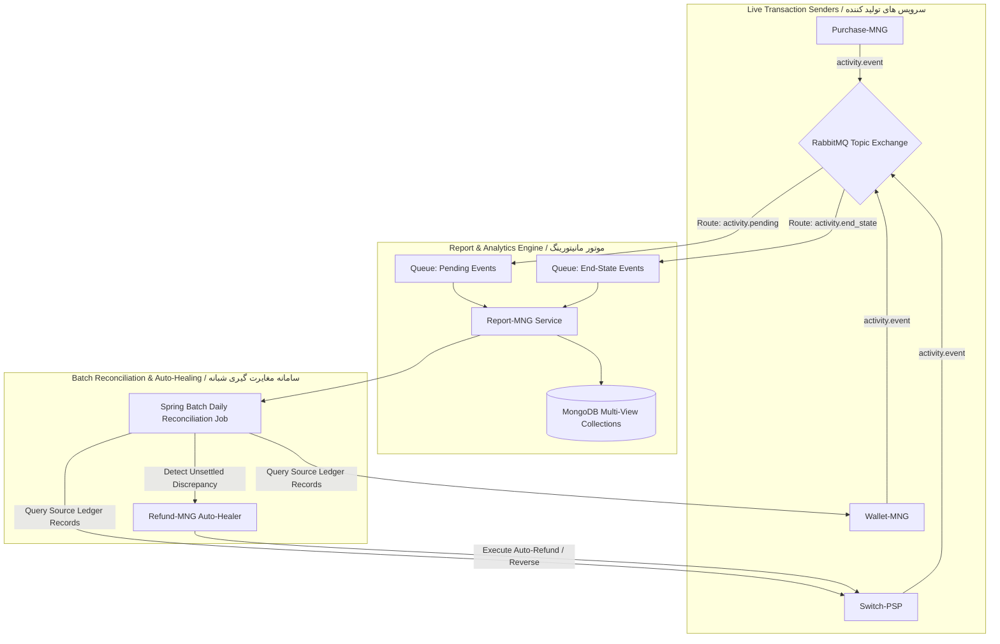

### English
In distributed microservices, network partitions between banks and core systems are inevitable. The platform relies on **Eventual Consistency** orchestrated via **Spring Batch** and **RabbitMQ**:
- **Dual-State Event Streaming:** Services emit `activity.pending` upon payment initiation to provide instant visibility on user screens. Once the PSP confirms or cancels, an `activity.end_state` event updates the transaction view.
- **Nightly Spring Batch Scanners:** Runs automated nightly jobs matching internal wallet debit journals against external PSP settlement files and banking Clearing Logs.
- **Autonomous Auto-Healing:** Detected discrepancies trigger automated reversal jobs directed to `Refund-MNG`, which dispatches automated refunds to the originating PAN or IBAN without human intervention.

### فارسی
در معماری‌های توزیع‌شده با رخداد خطاهای غیرمترقبه شبکه بانکی، **پایداری نهایی (Eventual Consistency)** با فرآیندهای خودکار برقرار می‌شود:
- **انتشار رخدادهای دو وضعیتی:** ثبت وضعیت `pending` برای آگاهی آنی کاربر و سپس ثبت وضعیت `end_state` پس از دریافت تاییدیه شاپرک یا خطا.
- **مغایرت‌گیری دسته‌ای (Spring Batch):** مقایسه خودکار اسناد حسابداری داخلی با فایل‌های گزارش تسویه روزانه PSPها و پایا به صورت شبانه.
- **ترمیم خودکار مغایرت‌ها:** در صورت احراز مغایرت (مانند کسر وجه بدون دریافت خدمت)، سرویس به صورت خودکار پیام بازگشت وجه را برای `Refund-MNG` صادر می‌کند تا مبلغ به شماره کارت مبدا مسترد گردد.

---

## 14. Product Manager's Operations & SLA Matrix / راهنمای عملیاتی و شاخص‌های کلیدی مدیر محصول

To successfully manage a high-scale financial platform in Iran, a Product Manager must track system health through clear metrics:

| Subsystem / زیرسیستم | Primary Metric / شاخص کلیدی | Target SLA / سطح استاندارد | Automatic Action on Breach / واکنش خودکار سیستم |
| :--- | :--- | :--- | :--- |
| **API Gateway** | P99 Latency & 429 Error Rate | $< 50\text{ ms}$, $< 0.1\%$ | Dynamically increase Redis token bucket quotas; throttle non-essential traffic. |
| **Switch-PSP** | Payment Success Rate (PSR) | $> 88\%$ per PSP | Dynamically degrade PSP routing weight to 0%; failover to backup PSP. |
| **Wallet Ledger** | Ledger Journal Balance Invariant | Strictly zero delta ($= 0$) | Halt wallet withdrawals immediately; sound P1 on-call critical alarm. |
| **Credit Scoring** | Default Probability at Allocation | $< 1.8\%$ NPL | Increase required ICS bank score threshold; enforce mandatory cheques. |
| **Merchant Credit** | T+1 Early Settlement Payout Rate | $> 99.2\%$ completed $< 24\text{h}$ | Retry bank SFTP transmission; alert financial operations for manual transfer. |
| **eKYC Engine** | Shahkar Verification Latency | $< 1200\text{ ms}$ | Route to secondary multi-provider KYC aggregator; display friendly retry screen. |

---

## 👨‍💻 About the Author / درباره نویسنده

**Ariya Sarrafzadeh** is a Senior Product Leader and Distributed Systems Architect specializing in FinTech, Payment Switch Infrastructure, and Large-Scale Financial Platforms.

- **Website / Portfolio:** [ariya-sarrafzadeh.ir](https://ariya-sarrafzadeh.ir)
- **Specializations:** High-Throughput Event-Driven Microservices, Payment Rails, BNPL, Idempotent Financial Ledgers, and Regulatory Integrations.