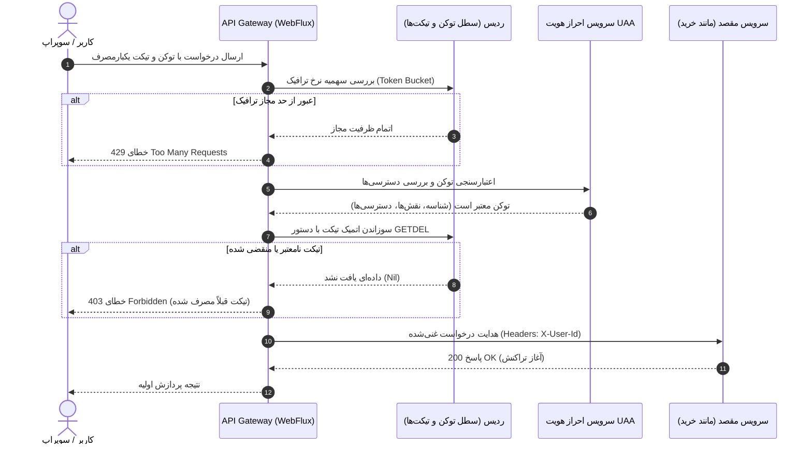
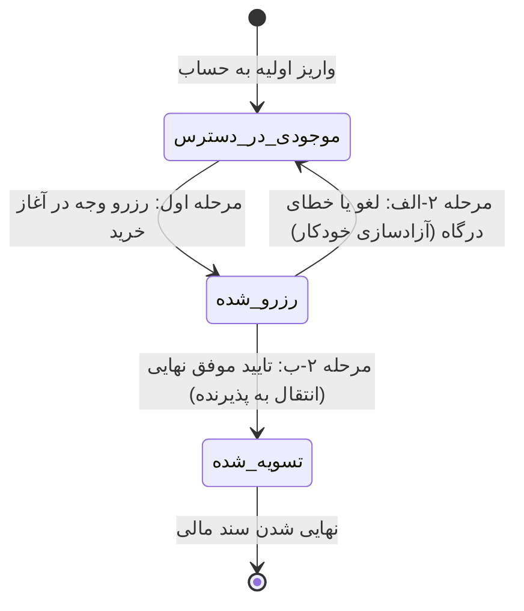
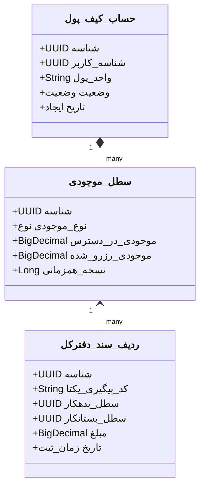
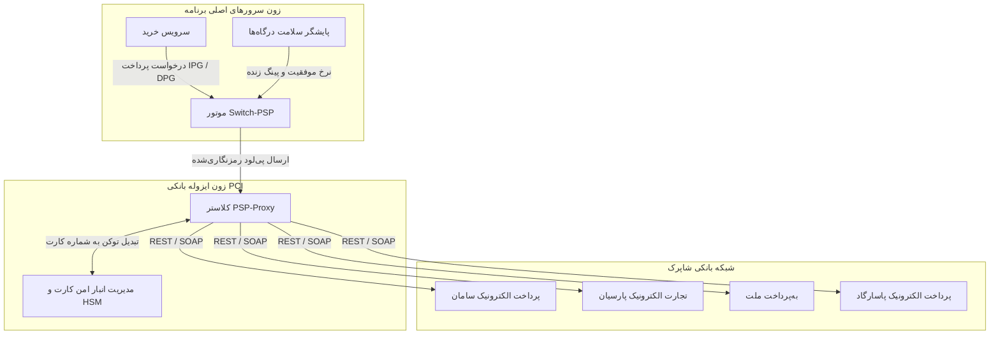
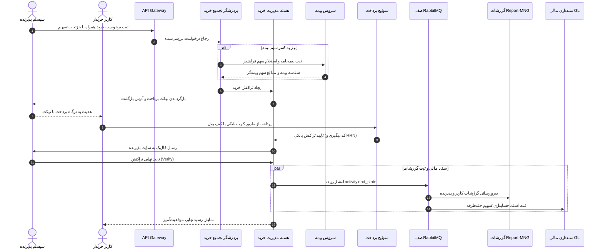
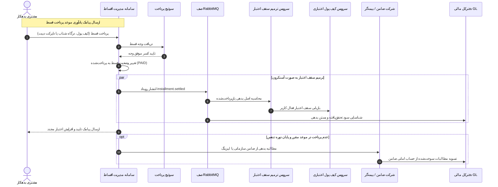
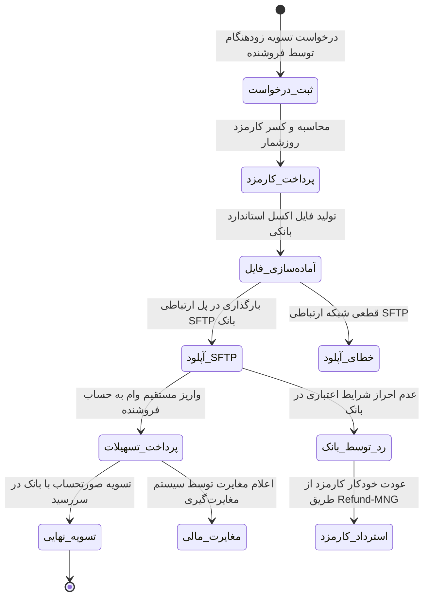
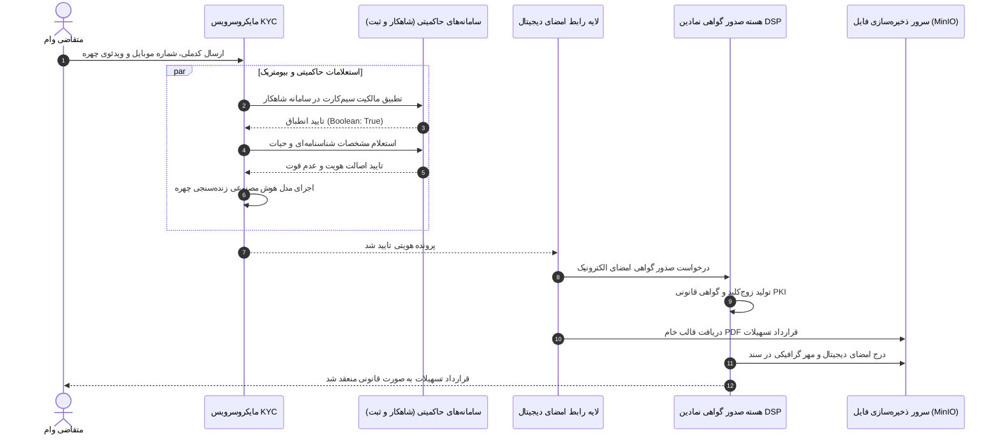

# راهنمای جامع معماری سیستم و میکروسرویس‌های فین‌تک در مقیاس سازمانی

**نویسنده:** آریا صراف‌زاده  
**وب‌سایت:** [ariya-sarrafzadeh.ir](https://ariya-sarrafzadeh.ir)  
**مخاطبان هدف:** معماران سیستم‌های توزیع‌شده، مهندسان ارشد بک‌اند و مدیران محصول فنی (Technical PMs)  
**فناوری‌های کلیدی:** Java (Spring Boot, Spring WebFlux)، RabbitMQ، Redis، MongoDB، MySQL، MinIO و زون‌های امنیتی شاپرک  
**موضوعات تخصصی:** زیرساخت‌های بانکی ایران، شاپرک، دفتر کل دوطرفه کیف پول (Double-Entry)، سوئیچ هوشمند PSP، کردیت و BNPL، احراز هویت شاهکار و تسویه زودتر از موعد فروشندگان  

---

## فهرست مطالب
۱. [چالش‌ها و واقعیت‌های مهندسی فین‌تک در ایران](#۱-چالش‌ها-و-واقعیت‌های-مهندسی-فین‌تک-در-ایران)  
۲. [توپولوژی و ساختار کلان میکروسرویس‌ها](#۲-توپولوژی-و-ساختار-کلان-میکروسرویس‌ها)  
۳. [لایه ورودی گیت‌وی و اعتبارسنجی تیکت‌محور (Ticket AuthNZ)](#۳-لایه-ورودی-گیت‌وی-و-اعتبارسنجی-تیکت‌محور-ticket-authnz)  
۴. [موتور دفتر کل کیف پول با تراز دوطرفه (Double-Entry Ledger)](#۴-موتور-دفتر-کل-کیف-پول-با-تراز-دوطرفه-double-entry-ledger)  
۵. [سوئیچ هوشمند پرداخت (PSP Switch) و ایزولاسیون اطلاعات کارت](#۵-سوئیچ-هوشمند-پرداخت-psp-switch-و-ایزولاسیون-اطلاعات-کارت)  
۶. [موتور خرید و تسهیم پویای کارمزد (Purchase & Dynamic Split)](#۶-موتور-خرید-و-تسهیم-پویای-کارمزد-purchase--dynamic-split)  
۷. [زیرساخت تسهیلات خرد، اعتبارسنجی و BNPL](#۷-زیرساخت-تسهیلات-خرد-اعتبارسنجی-و-bnpl)  
۸. [چرخه عمر اقساط، ترمیم سقف اعتبار (Revolving) و پوشش ریسک ضامن](#۸-چرخه-عمر-اقساط-ترمیم-سقف-اعتبار-revolving-و-پوشش-ریسک-ضامن)  
۹. [ریل‌های بانکی کشور: پایا، ساتنا، برداشت مستقیم و هاب فناوران](#۹-ریل‌های-بانکی-کشور-پایا-ساتنا-برداشت-مستقیم-و-هاب-فناوران)  
۱۰. [سرویس تسویه زودتر از موعد فروشندگان (Merchant Early Settlement)](#۱۰-سرویس-تسویه-زودتر-از-موعد-فروشندگان-merchant-early-settlement)  
۱۱. [احراز هویت دیجیتال (eKYC)، شاهکار و سامانه امضای الکترونیک (DSP)](#۱۱-احراز-هویت-دیجیتال-ekyc-شاهکار-و-سامانه-امضای-الکترونیک-dsp)  
۱۲. [پایداری نهایی داده‌ها، مانیتورینگ و مغایرت‌گیری خودکار با Spring Batch](#۱۲-پایداری-نهایی-داده‌ها-مانیتورینگ-و-مغایرت‌گیری-خودکار-با-spring-batch)  
۱۳. [ماتریس عملیاتی، شاخص‌های کلیدی (KPI) و واکنش خودکار سیستم](#۱۳-ماتریس-عملیاتی-شاخص‌های-کلیدی-kpi-و-واکنش-خودکار-سیستم)  

---

## ۱. چالش‌ها و واقعیت‌های مهندسی فین‌تک در ایران

توسعه پلتفرم‌های مقیاس‌بالای مالی در ایران با چالش‌های فنی و زیرساختی منحصربه‌فردی همراه است که در سیستم‌های متداول غربی کمتر دیده می‌شود:
- **ناهماهنگی درگاه‌های بانکی:** در غیاب ارائه‌دهندگان یکپارچه نظیر Stripe یا Adyen، شرکت‌های ارائه‌دهنده خدمات پرداخت (PSPها مانند سامان، پارسیان، به پرداخت ملت، پاسارگاد) از پروتکل‌های موروثی متفاوتی استفاده می‌کنند و کدهای خطا یا رفتارهای تایم‌اوت نامتقارنی دارند.
- **تسویه‌های دسته‌ای در چرخه‌های زمانی معین:** جابجایی سرمایه به صورت لحظه‌ای به حساب بانکی مقصد واریز نمی‌شود، بلکه از طریق سیکل‌های پایا ($۰۳:۴۵$، $۱۰:۴۵$، $۱۳:۴۵$ و $۱۸:۴۵$) تسویه می‌گردد. در نتیجه، سیستم باید پایداری نهایی (Eventual Consistency) و صف‌های تراکنش‌های معلق را به طور دقیق مدیریت کند.
- **سامانه رمز دوم پویا (هریم):** پرداخت‌های اینترنتی بدون حضور فیزیکی کارت به زیرساخت هریم بانک مرکزی متصل هستند که پیچیدگی تبادل پیام و تجربه کاربری را افزایش می‌دهد.
- **حفظ امنیت داده‌های کارت و تفکیک زون‌های شبکه:** مطابق با الزامات شاپرک و استانداردهای مشابه PCI-DSS، شماره کارت خام (PAN)، کدهای امنیتی (CVV2) و اطلاعات حساس نباید در پایگاه‌های داده اصلی یا سرورهای عمومی برنامه ثبت و ذخیره شوند.

این راهنما، معماری میکروسرویس‌های تولیدی پلتفرم‌های پرداخت و سوپراپ‌های مالی ایران را کالبدشکافی می‌کند.

---

## ۲. توپولوژی و ساختار کلان میکروسرویس‌ها

سیستم به منظور تفکیک مسئولیت‌ها و ایزولاسیون ریسک‌های مالی، به لایه‌های مجزا تفکیک شده است:

```mermaid
graph TB
    subgraph لایه ورودی و کلاینت‌ها
        MobileApp[اپلیکیشن موبایل - اندروید و iOS]
        WebPortal[پرتال‌های وب پذیرندگان و کاربران]
        Partners[پذیرندگان شریک و B2B]
    end

    subgraph لایه لبه و امنیت
        Gateway[API Gateway - Spring Cloud Gateway]
        UAA[سرویس مدیریت هویت و دسترسی - UAA]
        ConfigServer[سرور تنظیمات متمرکز - Config Server]
        ScheduleMNG[مدیریت تسک‌های زمان‌بندی‌شده - Quartz]
    end

    subgraph هسته تراکنش و دفترداری مالی
        PurchaseMNG[مدیریت و تجمیع خرید - Purchase-MNG]
        WalletMNG[سرویس دامنه کیف پول - Wallet-MNG]
        Ledger[موتور دفتر کل دوطرفه - Ledger]
        SwitchPSP[سوئیچ پرداخت شاپرک - Switch-PSP]
        RefundMNG[موتور استرداد وجه - Refund-MNG]
    end

    subgraph زون ایزوله پردازش بانکی PCI
        Vault[هماهنگ‌کننده و انبار امن کارت - Vault]
        PSPProxy[کلاستر پروکسی‌های PSP]
        BankProxy[پروکسی خدمات بانکی - پایا، ساتنا، دایرکت دبیت]
    end

    subgraph لایه تسهیلات و BNPL
        CreditOnboard[تشکیل پرونده اعتباری - Onboarding]
        CreditScore[موتور ارزیابی و امتیازدهی - Credit-Score]
        SwitchCredit[سوئیچ تامین‌کنندگان اعتبار - Switch-Credit]
        CreditProvider[کیف پول اعتباری درون‌سازمانی]
        InstallmentMNG[مدیریت و وصول اقساط - Installment]
        RevolvingMNG[موتور ترمیم سقف اعتبار - Revolving]
    end

    subgraph خدمات تکمیلی
        MerchantCredit[تسویه زودتر از موعد فروشندگان]
        PDY[پرداخت‌یاری شاپرک - PDY]
        KYC[موتور احراز هویت شاهکار و ثبت‌احوال]
        DSP[مرکز صدور گواهی و امضای دیجیتال - DSP]
    end

    subgraph بستر رویدادمحور و لاگ
        RabbitMQ((کلاستر صف RabbitMQ))
        ReportMNG[موتور گزارشات و اسپرینگ بچ - Report-MNG]
        Audit[سرویس ثبت لاگ تغییرناپذیر - Audit]
        Notification[ارسال پیامک و پوش نوتیفیکیشن]
    end

    %% اتصالات
    MobileApp & WebPortal & Partners --> Gateway
    Gateway --> UAA
    Gateway --> PurchaseMNG
    Gateway --> WalletMNG
    Gateway --> CreditOnboard
    Gateway --> MerchantCredit

    PurchaseMNG --> WalletMNG
    WalletMNG --> Ledger
    PurchaseMNG --> SwitchPSP
    SwitchPSP --> PSPProxy
    PSPProxy --> Vault

    CreditOnboard --> KYC
    CreditOnboard --> CreditScore
    CreditOnboard --> SwitchCredit
    SwitchCredit --> CreditProvider
    InstallmentMNG --> RevolvingMNG
    RevolvingMNG --> CreditProvider

    PurchaseMNG & WalletMNG & SwitchPSP & InstallmentMNG --> RabbitMQ
    RabbitMQ --> ReportMNG
    RabbitMQ --> Notification
    RabbitMQ --> Audit
```

---

## ۳. لایه ورودی گیت‌وی و اعتبارسنجی تیکت‌محور (Ticket AuthNZ)

لایه ورودی مانع از رسیدن ترافیک مخرب، حملات DDoS و درخواست‌های تکراری به سرویس‌های هسته می‌شود.



### ویژگی‌های کلیدی
۱. **مسیریابی واکنشی و غیرمسدودکننده (Spring Cloud Gateway / WebFlux Netty):** پردازش ده‌ها هزار کانکشن همزمان با حداقل مصرف حافظه و کنترل نرخ درخواست با الگوریتم Token Bucket در ردیس.  
۲. **توکن‌های امنیتی بدون حالت (Stateless JWT):** امضای نامتقارن توکن‌ها ($RSA\text{-}2048$) همراه با درج نقش‌ها و دسترسی‌های کاربر درون توکن، نیاز به استعلام مکرر دیتابیس را حذف می‌کند.  
۳. **تیکت‌های مالی یک‌بارمصرف:** برای تراکنش‌های پرریسک، کلاینت تیکتی موقت دریافت می‌کند. این تیکت در لایه گیت‌وی به صورت کامپکت و اتمیک با دستور `GETDEL` ردیس سوزانده می‌شود تا حملات Replay خنثی شوند.

---

## ۴. موتور دفتر کل کیف پول با تراز دوطرفه (Double-Entry Ledger)

تغییر مستقیم فیلد موجودی کاربر در دیتابیس، خطای نابخشودنی در معماری سیستم‌های مالی است. این پلتفرم از **دفتر کل دوطرفه تغییرناپذیر** همراه با **تخصیص دومرحله‌ای موجودی** استفاده می‌کند:



### اصل اساسی تراز صفر
هر ردیف سند حسابداری شامل حداقل دو رکورد بدهکار و بستانکار است و مجموع خالص تراز کل سیستم همواره صفر است:
$$\sum_{i=1}^{n} \text{Debit}_i - \sum_{j=1}^{m} \text{Credit}_j = 0$$



### سازوکارهای تضمین سلامت مالی
- **فاز اول (رزرو):** مبلغ از وضعیت `AVAILABLE` به `RESERVED` منتقل می‌شود. کاربر امکان خرج دوباره این وجه را ندارد، اما پول هنوز از حساب وی خارج نشده است.
- **فاز دوم (تایید یا جبران):** پس از دریافت وب‌هوک معتبر از شاپرک، وجه از وضعیت رزرو کسر و به کیف پول پذیرنده واریز می‌گردد. در صورت تایم‌اوت، وجه فوراً به وضعیت در دسترس بازگردانده می‌شود.
- **ایدامپوتنسی مطلق (Idempotency):** تمامی اندپوینت‌ها نیازمند کلید یکتای `trackingCode` هستند. درخواست‌های تکراری ناشی از قطع و وصل شبکه کاربر، پاسخ کش‌شده قبلی را دریافت می‌کنند.
- **تفکیک سطل‌های دارایی:** جداسازی دارایی نقدی قابل برداشت شتابی (`CASH`) از اعتبارات غیرقابل برداشت حاصل از کمپین و کش‌بک (`INTERNAL_CREDIT`).

---

## ۵. سوئیچ هوشمند پرداخت (PSP Switch) و ایزولاسیون اطلاعات کارت

سوئیچ پرداخت، اختلافات فنی PSPها را یکپارچه کرده و بهینه‌ترین مسیر پرداخت را برمی‌گزیند:



### الگوریتم روتینگ هوشمند
`Switch-PSP` هر ۳۰ ثانیه امتیاز عملکردی هر ترمینال را بر اساس رابطه زیر محاسبه می‌کند:
$$\text{Score} = w_1 \cdot \text{SuccessRate}_{\text{5min}} + w_2 \cdot \frac{1}{\text{Latency}_{\text{avg}}} + w_3 \cdot \text{CostEfficiency}$$
در صورت بروز اختلال در سوئیچ یک بانک، ترافیک بدون افت تجربه کاربری ظرف چند میلی‌ثانیه به درگاه پشتیبان هدایت می‌شود.

---

## ۶. موتور خرید و تسهیم پویای کارمزد (Purchase & Dynamic Split)

هماهنگی تراکنش‌ها، تسهیم چندبخشی، استعلام حق بیمه و تایید نهایی در `Purchase-MNG` صورت می‌گیرد:



---

## ۷. زیرساخت تسهیلات خرد، اعتبارسنجی و BNPL

مدیریت فرآیند اعطای خط اعتباری و خرید اقساطی بدون نیاز به مدارک کاغذی:

```mermaid
graph TD
    User([درخواست کاربر]) -->|ثبت‌نام و انتخاب طرح| Onboarding[فرآیند تشکیل پرونده اعتباری]
    
    subgraph احراز هویت و زنده‌سنجی
        Onboarding -->|تطبیق کدملی و سیم‌کارت| Shahkar[سامانه شاهکار - KYC]
        Onboarding -->|مشخصات شناسنامه‌ای و حیات| SabtAhval[سامانه ثبت‌احوال - KYC]
    end

    subgraph موتور اعتبارسنجی دوگانه
        Onboarding -->|استعلام چک برگشتی و تسهیلات معوق| ICS[سامانه اعتبارسنجی ایرانیان - ICS]
        Onboarding -->|تحلیل رفتار خرید و گردش حساب| EcosystemScore[ماتریس رفتارسنجی درون اکوسیستم]
        ICS & EcosystemScore --> ScoreCombiner{ترکیب امتیازات اعتباری}
        ScoreCombiner -->|تایید صلاحیت| CollateralCheck[بررسی تضامین و سفته الکترونیک]
    end

    subgraph تخصیص خط اعتبار
        CollateralCheck -->|تایید نهایی| SwitchCredit[سوئیچ تخصیص اعتبار]
        SwitchCredit -->|کیف پول اعتباری درون‌سازمانی| CreditProvider[سرویس Credit-Provider]
        SwitchCredit -->|کارت اعتباری متصل به شتاب| CreditCardProvider[سرویس Credit-Card-Provider]
    end
```

### تابع ماتریس اعتبارسنجی دوگانه
$$\text{CreditLimit} = f(\text{ICS}_{\text{BankingScore}}, \text{Score}_{\text{Ecosystem}}, \text{RiskCategory}_{\text{Merchant}})$$
ترکیب نمره سابقه بانکی کشور با تحلیل وفاداری و سابقه خرید کاربر در پلتفرم، سقف اعتبار امن را مشخص می‌کند.

---

## ۸. چرخه عمر اقساط، ترمیم سقف اعتبار (Revolving) و پوشش ریسک ضامن

مدیریت سررسید، پرداخت با درگاه‌های متنوع، بازیابی سقف اعتبار و جبران خسارت نکول:



---

## ۹. ریل‌های بانکی کشور: پایا، ساتنا، برداشت مستقیم و هاب فناوران

اتصال برنامه‌ریزی‌پذیر به سوئیچ‌های بانک مرکزی و پرداخت‌سازی:

```mermaid
graph LR
    subgraph سرویس‌های متقاضی داخلی
        WalletPayout[تسویه مانده کیف پول به حساب]
        DirectDebitTrigger[تمدید اشتراک و کسر اقساط]
        C2CTransfer[مینی‌اپ کارت به کارت]
    end

    subgraph زیرسیستم سوئیچ بانکی
        SwitchBank[هسته Switch-Bank] --> BankProxy[پروکسی سوئیچ‌های بانکی]
    end

    subgraph ریل‌های ملی مالی
        BankProxy -->|تسویه دسته‌ای پایا| PayaRail[سامانه پایا بانک مرکزی]
        BankProxy -->|حواله فوری ناخالص ساتنا| SatnaRail[سامانه ساتنا بانک مرکزی]
        BankProxy -->|قراردادهای پیمان / دایرکت دبیت| BankDirectDebit[بانکداری باز بانک‌های همکار]
        BankProxy -->|مجوز پرداخت‌سازی کارت به کارت| Faravaran[هاب فناوران شاپرک]
    end
```

---

## ۱۰. سرویس تسویه زودتر از موعد فروشندگان (Merchant Early Settlement)

تامین مالی نقدینگی فروشندگان مارکت‌پلیس در کمتر از ۲۴ ساعت بر پایه مدل SCF:



### فرمول محاسبه کارمزد روزشمار
$$\text{Fee} = \text{InvoiceAmount} \cdot (r_{\text{base}} + d \cdot r_{\text{daily}})$$
که در آن $d$ تعداد روزهای باقیمانده تا تسویه طبیعی فاکتور است (مثلاً ۰.۴٪ برای ۵ روز تا ۲.۵٪ برای ۳۰ روز).

---

## ۱۱. احراز هویت دیجیتال (eKYC)، شاهکار و سامانه امضای الکترونیک (DSP)

انعقاد قراردادهای رسمی تسهیلات بدون مراجعه به شعب فیزیکی:



---

## ۱۲. پایداری نهایی داده‌ها، مانیتورینگ و مغایرت‌گیری خودکار با Spring Batch

حفظ یکپارچگی اطلاعات در هنگام بروز اختلالات ارتباطی شبکه شتاب:

```mermaid
graph TD
    subgraph سرویس‌های مبدا تراکنش
        P[مدیریت خرید] -->|activity.event| Exchange{RabbitMQ Topic Exchange}
        W[کیف پول] -->|activity.event| Exchange
        S[سوئیچ پرداخت] -->|activity.event| Exchange
    end

    subgraph موتور پردازش رویداد و مانیتورینگ
        Exchange -->|رویداد در جریان| QPending[صف رویدادهای Pending]
        Exchange -->|رویداد وضعیت نهایی| QFinal[صف رویدادهای End-State]
        QPending & QFinal --> ReportMNG[سرویس گزارشات Report-MNG]
        ReportMNG --> MongoView[(مجموعه‌های دیتابیس MongoDB)]
    end

    subgraph سامانه مغایرت‌گیری دسته‌ای و خودترمیمی
        ReportMNG --> BatchJob[جاب شبانه Spring Batch]
        BatchJob -->|تطبیق با دیتابیس‌های مرجع| W & S
        BatchJob -->|تشخیص تراکنش ناموفق تسویه‌نشده| RefundEngine[موتور خودترمیمی Refund-MNG]
        RefundEngine -->|دستور استرداد خودکار به کارت| S
    end
```

---

## ۱۳. ماتریس عملیاتی، شاخص‌های کلیدی (KPI) و واکنش خودکار سیستم

| زیرسیستم | شاخص کلیدی عملکرد (KPI) | آستانه استاندارد SLA | واکنش خودکار سیستم در صورت نقض آستانه |
| :--- | :--- | :--- | :--- |
| **API Gateway** | تاخیر P99 و درصد خطای ۴۲۹ | $< 50\text{ ms}$, $< 0.1\%$ | افزایش سهمیه باکت ردیس و مسدودسازی ترافیک کم‌اهمیت |
| **Switch-PSP** | نرخ موفقیت پرداخت (PSR) | $> 88\%$ به ازای هر PSP | صفر کردن وزن ارجاع به درگاه و سوئیچ به درگاه جایگزین |
| **دفتر کل کیف پول** | انحراف تراز اسناد دوبل | اکیداً صفر ($\Delta = 0$) | توقف فوری عملیات برداشت و ارسال هشدار وضعیت بحرانی P1 |
| **تخصیص اعتبار** | نرخ مطالبات غیرجاری (NPL) | $< 1.8\%$ مطالبات سوخت‌شده | افزایش کف نمره اعتبارسنجی بانکی و اجباری کردن چک صیادی |
| **تسویه مرچنت** | نرخ انجام تسویه ظرف ۲۴ ساعت | $> 99.2\%$ تراکنش‌ها | تلاش مجدد ارسال SFTP و ارسال آلرت به تیم مالی عملیات |
| **احراز هویت eKYC** | تاخیر استعلام شاهکار | $< 1200\text{ ms}$ | انتقال به پروایدر رزرو شاهکار و نمایش لودینگ شفاف به کاربر |

---
*منتشر شده به عنوان مرجع تخصصی معماری سیستم‌های فین‌‌تک در وب‌سایت [ariya-sarrafzadeh.ir](https://ariya-sarrafzadeh.ir).*